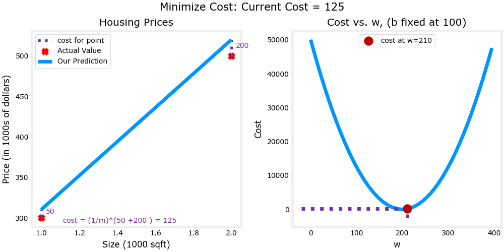

**说明：
参考课程[Supervised Machine Learning: Regression and Classification | Coursera](https://www.coursera.org/learn/machine-learning)**

# 监督学习定义 Definition
给定一个数据，能够输出相对应的数据，本质上是一种确认输入和输出的关系
监督学习主要分为**回归regression**和**分类classification**

## 回归 Regression
预测**连续输出**的结果，将输入的变量映射到**某个连续函数**中

## 分类 Classification
预测**离散输出**的结果，将输入的变量映射到**离散类别**中

# 一元线性回归 Linear Regression with One Variable
## 模型表示
- $x^{(i)}$ 表示**输入变量**
- $y^{(i)}$ 表示**输出变量**或者预测的目标变量
- $(x^{(i)},y^{(i)})$ 称为**训练样例**
- $m$ 个训练样例的集合$(x^{(i)},y^{(i)});i=1,...,m$ 称为**训练集training set**

给定一个训练集，学习一个函数 $h:X\to{Y}$ ，这样$h(x)$是$y$的相对于的“预测因子”，函数 $h$ 被成为**假设hypothesis**
```argdown
<predicted y>
	+ <h> #pro
		+ <x>
		+ Learning Algorithm
			+ Training Set
```
预测的目标变量是连续的时，所学习的问题称为回归问题；当 $y$ 只能取少量离散值时，称为分类问题

## 代价函数 Cost Function
通过特征和目标输出组成的训练集来拟合一个函数模型
假设此一元回归函数为
$$
f_{w,b}(x)=wx+b
$$
参数为 $w, b$
确定 $w, b$ 之后，通过给定 $x^{(i)}$ 得到对应的 $f(x^{(i)})$ 的值，即**预测值 $\hat{y}^{(i)}$** ，如果模型准确，则对于所有的 $(x^{(i)},y^{(i)})$ ，**$\hat{y}^{(i)}$ 接近 $y^{(i)}$**
预测值 $\hat{y}^{(i)}$ 和真实值 $y^{(i)}$ 的差，即$(\hat{y}^{(i)}-y^{(i)})$ ，称为**误差error**
假设有 $m$ 个训练样例，所有 $x^{(i)}$ 对应的误差的平方均值，通常会再 $÷2$ ，即
$$
J(w,b)=\frac{1}{2m}\sum^{m}_{i=1}\left(f_{\vec{w},b}(\vec{x}^{(i)})-y^{(i)}\right)^2
$$
称之为**代价函数** [Python实现代价函数](机器学习Python源码.md##代价函数)
训练模型的标准，就是**使 $J(w,b)$ 尽可能最小**


此函数是常用的代价函数之一，称为**均方误差mean squared error**
**平均值减半**，以方便计算梯度下降

## 梯度下降 Gradient Descent
代价函数位于最低点时，其值最小
对于一元代价函数，取其导数，即切线，提供前进的方向，向下降最陡的方向降低成本函数
每一步下降的步长，由**学习率learning rate $\alpha$** 确定

复杂的代价函数，可能会出现多个极值点，则梯度下降会落在不同的点
对于代价函数
$$
J(w,b)=\frac{1}{2m}\sum^{m}_{i=1}\left(f_{\vec{w},b}(\vec{x}^{(i)})-y^{(i)}\right)^2
$$
梯度下降算法为：

***重复直到收敛 {***
$$
\begin{gather}
w:=w-\alpha\frac{\partial{J(w,b)}}{\partial{w}}\\
b:=b-\alpha\frac{\partial{J(w,b)}}{\partial{b}}\\
\end{gather}
$$
***}***

其中
$$
\begin{gather}
\frac{\partial{J(w,b)}}{\partial{w}}=\frac{1}{m}\sum\limits_{i=1}^{m}\left(f_{\vec{w},b}(\vec{x}^{(i)})-y^{(i)}\right)x^{(i)}\\
\frac{\partial{J(w,b)}}{\partial{b}}=\frac{1}{m}\sum\limits_{i=1}^{m}\left(f_{\vec{w},b}(\vec{x}^{(i)})-y^{(i)}\right)
\end{gather}
$$
==之前代价函数多 $\times\frac{1}{2}$ 可以与求导得到的 $2$ 相约分==
[Python实现梯度下降](机器学习Python源码.md#梯度下降##梯度下降)

```ad-info
以 $w$ 参数为例
当代价函数取值在递增区间时，$\frac{\partial{J(w,b)}}{\partial{w}}>0$，$w$ 向代价函数取值低的方向移动，反之在递减区间时，$\frac{\partial{J(w,b)}}{\partial{w}}<0$，，$w$ 向代价函数取值低的方向移动

```

```ad-note
每次重复迭代时，应**同时更新参数**
$$
\begin{gather}
temp_w:=\alpha\frac{\partial{J(w,b)}}{\partial{w}}\\
temp_b:=\alpha\frac{\partial{J(w,b)}}{\partial{b}}\\
w:=w-temp_w\\
b:=b-temp_b
\end{gather}
$$
```
同时，**应调整学习率 $\alpha$** 以确保梯度下降算法在合理的时间内收敛
当接近凸函数的底部时，导数为0，此时
$$
\begin{gather}
\frac{\partial{J(w,b)}}{\partial{w}}=0\\
\frac{\partial{J(w,b)}}{\partial{w}}=0\\
w:=w\\
b:=b
\end{gather}
$$

### 学习率 Learning Rate
***调试梯度下降***：在 $x$ 轴上创建具有迭代次数的图，绘制代价函数 $J(w,b)$ 在梯度下降的迭代次数上的值，当梯度下降使**代价函数趋近于 $0$** ，并且其**图像趋于平稳**时，梯度下降收敛
***自动收敛测试***：让 $\epsilon$ 为 $10^{-3}$ ，如果某次迭代小于此数，证明其收敛

- 如果 $\alpha$ 太小
  梯度下降会**缓慢**
- 如果 $\alpha$ 太大
  - 梯度下降迭代**越过最小值点**
  - **永不收敛**

    
#### 设置学习率
通过梯度下降的收敛来判断学习率 $\alpha$ 的情况
- **$\alpha$ 过小**

- **$\alpha$ 过大**


# 多元线性回归 Multivariate Linear Regression
## 多维特征 Multiple Features
当一个某些受多个变量影响时
$$
f_{w,b}(x)=w_1x_1+w_2x_2+\dots+w_nx_n+b
$$
- $x_j$ 表示第 $j$ 个特征
-  $n$ 表示特征总数
- $\vec{x}^{(i)}$ 表示第 $i$ 个训练样例的特征集
- $x^{(i)}_j$ 表示第 $i$ 个训练样例的第 $j$ 个特征
用向量表示
$$
\begin{gather}
\vec{w}=\begin{bmatrix}
w_1 & w_2 & w_3 & ... & w_n
\end{bmatrix}\\
\vec{x}=\begin{bmatrix}
x_1 & x_2 & x_3 & ... & x_n
\end{bmatrix}
\end{gather}
$$
$f_{w,b}(x)$ 可表示为
$$
f_{\vec{w},b}(\vec{x})=\vec{w}\cdot\vec{x}+b
$$

### 向量化 Vectorization
在一些计算机硬件（如GPU）中，可以运用其**并行性**，运行向量化代码来提高运算效率
如果不适应向量化，则 $f_{\vec{w},b}(\vec{x})$ 运算方法为
$$
f_{\vec{w},b}(\vec{x})=\sum_{j=1}^nw_jx_j+b
$$
```python
f = 0
for j in range(n):
	f = f + w[n] * x[n]
f = f + b
```
在Python中可以直接使用**NumPy**实现向量点乘
```python
f = np.dot(w,x) + b
```
通过并行运算，可以实现**同一时间计算多个 $w_jx_j$ 的值**，从而提高计算效率
[向量化提高效率](机器学习Python源码.md##向量化)

## 多元梯度下降 Gradient Descent for Multiple Variables
与一元[梯度下降](##梯度下降 Gradient Descent)类似，也要注意需要同时更新参数
***重复直到收敛 {***
$$
\begin{gather}
w_1:=w_1-\alpha\frac{\partial{J(\vec{w},b)}}{\partial{w_1}}\\
w_2:=w_2-\alpha\frac{\partial{J(\vec{w},b)}}{\partial{w_2}}\\
\vdots\\
b:=b-\alpha\frac{\partial{J(\vec{w},b)}}{\partial{b}}\\
\end{gather}
$$
***}***

## 特征缩放 Feature Scaling
多元函数的变量可能处于不同的取值范围，梯度下降时，$w$ 处于大范围内下降缓慢，处于小范围时下降较快
- **除最大值 Dividing by the Maximum**
$$
x_{j,scaled}=\frac{x_j}{x_{j,max}}
$$
特征值 $x_{j,scaled}$ 分布在 \[0, 1\] 之间
- **均值归一化 Mean Normalization**
$$
x_{j,scaled}=\frac{x_j-\mu_j}{x_{j,max}-x_{j,min}}
$$
$\mu_j$ 是特征 $x_j$ 的平均值，特征值 $x_{j,scaled}$ 分布在 \[-1, 1\] 之间
- **Z-score归一化 Z-score Normalization**
$$
x_{j,scaled}=\frac{x_j-\mu_j}{\sigma_{j}}
$$
$\sigma_j$ 是特征 $x_j$ 的标准差，特征值 $x_{j,scaled}$ 分布与均值归一化相似，范围更大


## 特征工程 Feature Engineering
利用直觉或相关知识，通过变换或合并的方式**创造出一个新特征**
例如：根据土地的长和宽作为特征的模型可以创造出土地面积作为新特征
$$
\begin{gather}
f_{\vec{w},b}(\vec{x})=w_1x_1+w_2x_2+b\\
x_3=x_1x_2\\
f_{\vec{w},b}(\vec{x})=w_1x_1+w_2x_2+w_3x_3+b\\
\end{gather}
$$

## 多项式回归 Polynomial Regression
假设函数不一定是线性的，可以通过设置为二次方、三次方或平方根来改变函数


例如
$$
\begin{gather}
f_{\vec{w},b}(x)=w_1x+w_2x^2+w_3x^3+b\\
f_{\vec{w},b}(x)=w_1x+w_2\sqrt{x}+b
\end{gather}
$$
在此情况下，**特征缩放**尤其重要
对于符合的特征，其目标值取特征值呈线性关系


# 分类 Classification
## 动机 Motivation
分类问题是指预测的目标值为有限个，以二元分类为例，主要分为两类 $0$ 或 $1$ ，即True或False
对于二元分类，我们可以根据线性回归得到其“分类线性回归模型”
![[Figure_14.png]]
似乎当 $y=0.5$ 为两个类别的分界线，由此得出
$$
\hat{y}=
\begin{cases}
0,&f_{w,b}(x)\le0.5 \\
1,&f_{w,b}(x)>0.5
\end{cases}
$$
但当有 $x\to\infty,y=1$ 的样本时，模型的斜率会下降，再以 $y=0.5$ 作为边界会导致其准确降低
![[Figure_15.png]]

## 逻辑回归 Logistic Regression
**`sigmod`函数**可以有效地将不同类别分开
$$
f_{sigmod}(z)=\frac{1}{1+e^{-z}},0<f_{sigmod}(z)<1
$$
```functionplot
---
title: sigmod
xLabel: z
yLabel: y
bounds: [-5,5,-2,2]
disableZoom: true
grid: true
---
f(x)=1/(1+E^(-x))
```
`sigmod`函数的输入 $z$ 就是所有训练样例的线性回归函数模型
$$
\begin{gather}
z=\vec{w}\cdot\vec{x}+b \\
f_{\vec{w},b}(\vec{x})=f_{sigmod}(\vec{w}\cdot\vec{x}+b)=\frac{1}{1+e^{-(\vec{w}\cdot\vec{x}+b)}}
\end{gather}

$$
```functionplot
---
title: sigmod with z=2x-3
xLabel: x
yLabel: y
bounds: [-5,5,-2,2]
disableZoom: true
grid: true
---
f(x)=1/(1+E^(-2x+3))
g(x)=2x-3
```
$f_{\vec{w},b}(x)$ 即为基本的**逻辑函数 logistic function**
```ad-info
逻辑函数的值即为样本目标值为 $y=1$ 的概率，所以逻辑函数也可以表示为
$$
f_{\vec{x},b}(x)=P(y=1|\vec{x};\vec{w},b)
$$
```

## 决策边界 Decision Boundary
在`sigmod`函数中，因为 $f_{\vec{w},b}(x)\in(0,1)$ ，所以决定 $\hat{y}$ 是0或1需要一个**阈值threshold**，设其为 $a$，有
$$
\hat{y}=
\begin{cases}
0,&f_{w,b}(x)\le{a} \\
1,&f_{w,b}(x)>a
\end{cases}
$$
这个阈值即为**决策边界**
在`sigmod`函数中通常 $a=0.5$ 时，其决策边界为
$$
\vec{w}\cdot\vec{x}+b=0
$$
此表达式在其他学习模型中**通用**为
$$
z=0
$$
## 逻辑回归的代价函数 Cost Function for Logistic Regression
对于逻辑函数，均方误差的代价函数并不使用，可能会产生多个某个区间上的极小值点
![[Figure_16.png]]
均方误差代价函数是各单一训练样例的误差（定义为 $L(f_{\vec{w},b},y^{(i)})$ ）之和
在逻辑函数中，单一**逻辑*损失函数*logistic loss function**为
$$
L(f_{\vec{w},b}(\vec{x}^{(i)}),y^{(i)})=
\begin{cases}
-\log\left(f_{\vec{w},b}((\vec{x}^{(i)})\right),&y^{(i)}=1 \\
-\log\left(1-f_{\vec{w},b}(\vec{x}^{(i)})\right),&y^{(i)}=0 
\end{cases}
$$
由于 $f(\vec{w},b)\in[0,1]$ ，所以只考虑这一部分
![[Figure_17.png]]
则逻辑函数的代价函数为所有逻辑损失函数的均值
$$
J(\vec{w},b)=\frac{1}{m}\sum_{i=1}^{m}L(f_{\vec{w},b},y^{(i)})
$$

### 简化代价函数 Simplified Cost Function
$L(f_{\vec{w},b},y^{(i)})$ 可以合并为
$$
\begin{gather}
L(f_{\vec{w},b}(\vec{x}^{(i)}),y^{(i)})=
-y^{(i)}\log\left(f_{\vec{w},b}(\vec{x}^{(i)})\right)-(1-y^{(i)})\log\left(1-f_{\vec{w},b}(\vec{x}^{(i)})\right)
\end{gather}
$$
$$
\begin{align}
J(\vec{w},b)&=\frac{1}{m}\sum_{i=1}^{m}L(f_{\vec{w},b},y^{(i)}) \\&
=-\frac{1}{m}\sum_{i=1}^{m}
\left[y^{(i)}\log\left(f_{\vec{w},b}(\vec{x}^{(i)})\right)+\left(1-y^{(i)}\right)\log\left(1-f_{\vec{w},b}(\vec{x}^{(i)})\right)\right]

\end{align}
$$
此代价函数是由**最大似然估计maximum likelihood**所推导的

## 实现梯度下降 Gradient Descent Implementation
与线性回归的梯度下降相似
***重复直到收敛 {***
$$
\begin{gather}
w_j:=w_j-\alpha\frac{\partial}{\partial{w_j}}{J(\vec{w},b)}\\
b:=b-\alpha\frac{\partial}{\partial{b}}{J(\vec{w},b)}
\end{gather}
$$
***}***

其中
$$
\begin{gather}
\frac{\partial{J(\vec{w},b)}}{\partial{w_j}}=\frac{1}{m}\sum\limits_{i=1}^{m}\left(f_{\vec{w},b}(\vec{x}^{(i)})-y^{(i)}\right)x^{(i)}_j\\
\frac{\partial{J(\vec{w},b)}}{\partial{b}}=\frac{1}{m}\sum\limits_{i=1}^{m}\left(f_{\vec{w},b}(\vec{x}^{(i)})-y^{(i)}\right)\\
f_{\vec{w},b}(\vec{x})=\frac{1}{1+e^{-(\vec{w}\cdot\vec{x}+b)}}
\end{gather}
$$
![[Figure_18.png]]

# 过拟合 Over-fitting
- 如果只是简单的模型，数据集的预测值与真实值有**较大偏差high bias**，或者称模型对训练数据**欠拟合under-fitting**
![[Figure_19.png]]
![[Figure_22.png]]
- 当模型与数据集基本拟合，且能很好地预测未知数据，这样的能力称为“**泛化generalization**”
![[Figure_20.png]]
![[Figure_23.png]]
-  当特征更多，可以确保偏差更小，使得模型对于训练集的误差几乎为0，但不适合预测除训练集以外的数据，而且可能每次迭代拟合的模型都不同，此种情况称之为**过拟合**或**高方差high variance**
![[Figure_21.png]]
![[Figure_24.png]]

## 解决过拟合 Addressing Over-fitting
- 收集更多的训练样例
  更多的训练样例意味着更模型可以拥有更好的泛型和稳定性
- 使用更少的特征
- **正则化**
  将对模型变化影响较大的特征（多项式中的高指数）的指数取小，防止特征权重过大

### 正则化代价函数 Cost Function with Regularization
当代价函数增加以 $w_j$ 为特征的项
$$
J(\vec{w},b)=\frac{1}{2m}\sum^m_{i=1}\left(f_{\vec{w},b}(\vec{x}^{(i)})-y^{(i)}\right)^2+aw_j^2
$$
当 $a$ 很大，经过梯度下降后，$w_j$ 会很小
索性可以把每个特征都缩小点，得到**正则化代价函数**
$$
J(\vec{w},b)=\frac{1}{2m}\sum^m_{i=1}\left(f_{\vec{w},b}(\vec{x}^{(i)})-y^{(i)}\right)^2+\frac{\lambda}{2m}\sum^m_{j=1}w^2_j
$$
$\lambda$ 为**正则化参数regularization parameter**，根据实际情况取选择 $\lambda$ 的值
$\frac{\lambda}{2m}\sum^m_{j=1}w^2_j$ 为**正则化项regularization term**，而考虑 $\frac{\lambda}{2m}\sum^m_{j=1}b^2$ 的意义不大
梯度下降的目的也就变成了
$$
\min_{\vec{w},b}\left[\frac{1}{2m}\sum^m_{i=1}\left(f_{\vec{w},b}(\vec{x}^{(i)})-y^{(i)}\right)^2+\frac{\lambda}{2m}\sum^m_{j=1}w^2_j\right]
$$
因此最终模型的拟合度取决于 $\lambda$ 的取值—— **$\lambda$ 过大，模型欠拟合；$\lambda$ 过小，模型过拟合**

#### 正则化线性回归 Regularized Linear Regression
正则化的代价函数
$$
J(\vec{w},b)=\frac{1}{2m}\sum^m_{i=1}\left(f_{\vec{w},b}(\vec{x}^{(i)})-y^{(i)}\right)^2+\frac{\lambda}{2m}\sum^m_{j=1}w^2_j
$$
梯度下降与之前的线性回归梯度下降相同，仅导数部分有所变化
$$
\frac{\partial}{\partial{w_j}}{J(\vec{w},b)}=\frac{1}{m}\sum\limits_{i=1}^{m}\left(f_{\vec{w},b}(x^{(i)})-y^{(i)}\right)x_j^{(i)}+\frac{\lambda}{m}w_j
$$

#### 正则化逻辑回归 Regularized Logistic Regression
正则化代价函数
$$
\begin{align}
J(\vec{w},b)=&-\frac{1}{m}\sum_{i=1}^{m}\left[y^{(i)}\log\left(f_{\vec{w},b}(\vec{x}^{(i)})\right)+\left(1-y^{(i)}\right)\log\left(1-f_{\vec{w},b}(\vec{x}^{(i)})\right)\right]\\&
+\frac{\lambda}{2m}\sum^m_{j=1}w^2_j
\end{align}
$$
梯度下降与之前的逻辑回归梯度下降相同，仅导数部分有所变化
$$
\frac{\partial{J(\vec{w},b)}}{\partial{w_j}}=\frac{1}{m}\sum\limits_{i=1}^{m}\left(\frac{1}{1+e^{-(\vec{w}\cdot\vec{x}+b)}}-y^{(i)}\right)x^{(i)}_j+\frac{\lambda}{m}w_j
$$

最后编辑：*2023-02-08 15:02:44 CST*