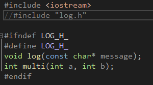
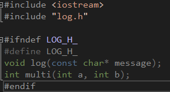
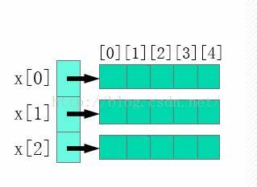

# 前言

## 不同类型操作系统下类型的大小

单位：byte(8bits)

|                   | x86  | x64  |
| :---------------: | :--: | :--: |
|     **char**      |  1   |  1   |
|     **char***     |  4   |  8   |
|  **short(int)**   |  2   |  2   |
|      **int**      |  4   |  4   |
| **unsigned int**  |  4   |  4   |
|     **long**      |  4   |  8   |
|   **long long**   |  8   |  8   |
| **unsigned long** |  4   |  8   |
|     **float**     |  4   |  4   |
|    **double**     |  8   |  8   |

# Object-Oriented-C++ 面向对象

对象包含：

- 数据：属性或者状态
- 操作：各种函数

Map:  From **problem space** to **solution space**

对象里的数据是不会被直接访问的

C语言不支持数据和函数之间的关系

```c
typedef struct Point3d{
    float x;
    float y;
    float z;
} Point3d;

void Point3d_print(const Point3d* pd);
Point3d a;
a.x = 1; a.y = 2; a.z = 3;
Point3d_print(&a);
```

C++ version

```c++
class Point3d{
public:
    Point3d(float x, float y, float z);
    print();
private:
    float x;
    float y;
    float z;
};

Point3d a(1,2,3);
a.print();
```

面向对象的特征：

- 一切都是客体。
- 程序是一堆对象，通过发送消息告诉彼此该做什么。
- 每个对象都有自己的由其他对象组成的内存。
- 每个对象都有一个类型。
- 特定类型的所有对象都可以接收相同的消息。

## C++程序文件结构

在C++中，分为`.h`和`.cpp`文件去定义一个类：

- 类的**声明(declaration)**和**原型(prototypes)**在头文件(`.h`)中
- 类的函数体在**源文件(source file)**(`.cpp`)中

![[images/image-20220215225745386.png]]

一个`.cpp`文件时一个编译单元

只有声明能出现在`.h`中：

- 外部变量
- 函数原型
- 类/结构体声明

**Example**

`ticketmachine.h`

```c++
#ifndef TICKETMACHINE_H_
#define TICKETMACHINE_H_

class TicketMachine{
public:
	TicketMachine();
	virtual ~TicketMachine();
	void showPrompt();
	void insertMoney(int money);
	void showBalance();
    int refundBalance()
private:
	const int PRICE;
	int balance = 0;
    int total;
};

#endif // TICKETMACHINE_H_
```

`ticketmachine.cpp`

```cpp
#include "ticketmachine.h"
#include <iostream>

using namespace std;

TicketMachine::TicketMachine() : PRICE(100)
{
}
TicketMachine::~TicketMachine()
{	
}
void TicketMachine::showPrompt()
{
	cout << "something";
}
void TicketMachine::insertMoney(int money)
{
	balance += money;
}
void TicketMachine::showBalance()
{
	cout << balance;
}
int TicketMachine::refundBalance()
{
	int amoutToRefund;
	amoutToRefund = balance;
	balance = 0;
	return amoutToRefund;
}
```

`main.cpp`

```cpp
#include <iostream>
#include "ticketmachine.h"

int main()
{
	TicketMachine tm;
	tm.insertMoney(100);
	tm.showBalance();
	tm.showPrompt();
	return 0;
}
```

## 头文件

### `#include`

`#include`适用于插入include文件到`.cpp`文件中：

- `#include "xx.h"`：在当前寻找头文件
- `#include <xx.h>`：在系统/编译器的include文件夹下寻找头文件
- `#include <xx>`：与`#include <xx.h>`相同

### 标准头文件结构

- `#` 空指令，无任何效果
- `#include` 包含一个源代码文件
- `#define` 定义宏
- `#undef` 取消已定义的宏
- `#if` 如果给定条件为真，则编译下面代码
- `#ifdef` 如果宏已经定义，则编译下面代码
- `#ifndef`如果宏没有定义，则编译下面代码

- `#elif` 如果前面的#if给定条件不为真，当前条件为真，则编译下面代码
- `#endif`结束一个`#if`...`#else`条件编译块

- `#error` 停止编译并显示错误信息

**为了避免那些只能包含一次的头文件被多次包含，可以在头文件中用编译时条件来进行控制**

```cpp
#ifndef HEADER_FLAG
#define HEADER_FLAG
// Type declaration here...
#endif // HEADER_FLAG
```

每次执行头文件编译时，都会执行`#ifndef HEADER_FLAG`，如果宏`HEADER_FLAG`不存在，则编译`#define HEADER_FLAG`...`#endif`部分；反之，不执行编译；这样保证此部分只被包含一次

## 抽象

抽象是忽略零件细节的能力，以将注意力集中在更高层次的问题上
模块化是将整体划分为明确定义的部分的过程，这些部分可以单独构建和检查，并以明确定义的方式进行交互

## 类成员

### 成员变量

在`ticketmachine.cpp`中

```cpp
int TicketMachine::refundBalance()
{
	int amoutToRefund;
	amoutToRefund = balance;
	balance = 0;
	return amoutToRefund;
}
```

`int amoutToRefund`是**本地变量(local variable)**，在该类的所有成员函数内都能引用

`balance`是类的**成员变量(field)**，可以在类的所有函数中引用

**如果本地变量和成员变量重名，只会调用本地变量**

成员变量不建议赋值初始化，应用列表初始化

### 成员函数

**成员函数属于类，而不属于类的对象**

以下两段代码等效：

**C++**

```cpp
#include <iostream>

using namespace std;

class A {
public:
	int i;
	void f();
};

void A::f()
{
	cout << "per" << i << endl;
	i = 10;
	cout << "after" << i << endl;
}

int main()
{
	A a{};
	
	cout << a.i << endl;
	a.i = 100;
	a.f();
	cout << a.i << endl;
}
```

**C**

```c
#include <stdio.h>

struct B
{
    int i;
};

void f(struct B* p)
{
    printf("per%d\n", p->i);
    p->i = 10;
    printf("after%d\n", p->i);
}

int main()
{
    B b{};

    printf("%d\n", b.i);
    b.i = 100;
    f(&b);
    printf("%d\n", b.i);
}
```

最后输出结果均为

```shell
0
per100
after10
10
```

由C语言部分可见函数`void f()`调用了`struct B`的指针，而不是`b`的

同理推测出，C++中`class A`中的成员函数`void f()`是属于`class A`的，而不是对象`a`

>注：在C++代码中`int i`在`class A`中**仅为声明**，简单理解不存在`class A`中，而是在构造对象`a`时才有定义，也就是说在代码中`a.i`调用的`i`是属于对象`a`的

**简单粗暴理解为：成员变量属于各个对象，而成员函数（方法method）属于全体对象，即整个类**

尝试输出地址，则`a.i`和`a`地址相同（如果是多变量则其他都相邻，相隔变量类型的单位字节大小），不能输出`a.f()`的地址

- 类定义是一种**类型声明**，存在于代码块中，**并没有分配内存空间**；对类的数据成员取地址，得到的是类的数据成员在类内的相对偏移量
- 类的对象是**类的实例化**，**分配内存空间**给实例化对象使用，类的对象的数据成员取地址，得到的是类的对象的数据成员在内存空间的实际地址

### private & public & protected

`public`：所有函数都可以访问

`private`：只有类的成员函数能够访问

> 注：并不仅局限于对象，相同类的对象之间可以访问（仅在编译时限制访问）
>
> ```cpp
> class C
> {
> private:
> 	int i;
> 	int* p;
> public:
> 	void set(int i) { this->i = i; }
> 	void g(C* q) { cout << q->i << endl; }
> };
> 
> C b, p;
> b.set(100);
> p.g(&b);
> ```
>
> `p`可访问`&b->i`

`protected`：只有类及其子类可以访问

### 友元

当其他类（或函数等）**被声明**一个类的友元时，可以访问其`private`和`protected`成员（在所属类中声明）

```cpp
struct X;

struct Y {
	void f(X*);
};

struct X {
private:
	int i;
public:
	void initialize();
	friend void g(X*, int);
	friend void Y::f(X*);
	friend struct Z;
	friend void h();
};

void g(X* x, int i)
{
	x->i = i;
}

void Y::f(X* x)
{
	x->i = 1;
}
```

> - **友元的授权在友元所属类的声明中声明的**
> - 与`private`一样，友元关系是在编译时检查的

## this

`this`是C++中的一个关键字，也是一个`const`指针，它指向当前对象（正在使用的对象），通过它可以访问当前对象的所有成员

> 注意，this 是一个指针，要用`->`来访问成员变量或成员函数

- `this`是`const`指针，它的值是不能被修改的，一切企图修改该指针的操作，如赋值、递增、递减等都是不允许的
- `this`只能在成员函数内部使用，用在其他地方没有意义，也是非法的
- 只有当对象被创建后`this`才有意义，因此不能在`static`成员函数中使用

## 构造与析构

### 构造器（构造函数）Constructor

```cpp
class X{
    int i;
public:
    X();	//构造函数
};
```

构造函数与类名称相同，**不返回任何类型**，在类创建的时候自动被调用，用于赋予成员变量初始值

> 在构造函数中加入`std::cout << this << std::endl;`就会发现会在最开始执行并且输出类的地址

构造赋值的方式：

```cpp
class A{
private:
    int i;
public:
    A(int n);
};

//1.
A::A(int n)
{
    i = n;
}

//2.
A::A(int n):i(n)
{
    i = n;	//可有可无
}

//3.直接在类中定义构造函数
class A{
private:
    int i;
public:
    A(int n) :i(n) {};
};

//-----------------------
A a(10);
```

如果：

```cpp
class A{
private:
    int i;
    int j;
public:
    A(int n);
};

A::A(int n):j(n),i(j)
{
    //等价于
    i = j;
    j = n;
}
```

此时以某种方式直接输出`i`或`j`的值，则`i`无值，`j = n`

构造赋值可用于为`const`成员变量赋值

```cpp
class A{
private:
    const int i;
public:
    A(int n);
};

A::A(int n):i(n) {}

//以下方式错误(x)
A::A(int n)
{
    i = n;
}
```

### 析构函数 Destructor

```cpp
class A{
private:
    int i;
public:
    A();
    ~A();	//析构函数
};
```

析构函数唯一作用就是在**删除对象**后释放已经分配的内存，不需要传入任何参数

如果用户没有定义，**编译器会自动生成一个默认的析构函数**

用`new`分配内存时会调用构造函数，用`delete`释放内存时会调用析构函数

**构造函数和析构函数对于类来说是不可或缺的**

- 在所有函数之外创建的对象是**全局对象**，位于内存分区中的全局数据区，**程序在结束执行时**会调用这些对象的析构函数
- 在函数内部创建的对象是**局部对象**，它和局部变量类似，位于栈区，函**数执行结束时**会调用这些对象的析构函数

简单来讲就是离开**作用域(scope)**时会调用析构函数

`new`创建的对象位于堆区，通过`delete`删除时才会调用析构函数；如果没有`delete`，析构函数就不会被执行

## 对象初始化

- 单个初始化

  ```cpp
  A a;
  ```

- 按数组形式初始化

  ```cpp
  A a[] = { A(), A(), A() };
  ```

  但如果指定长度，则必须一一对应，不可过多或过少

  ```cpp
  A a[3] = { A(), A() };	//(x)
  > error C2512: “A”: 没有合适的默认构造函数可用
  ```

## `new` & `delete`

内存模型：堆、堆栈、全局数据区

`new`和`delete`是控制堆上的内存，通过`new`和`delete`可以实现二维数组

### `new`

```cpp
new int;
new A;
new int[10];
```

可以是包括数组在内的任意内置的数据类型，也可以是包括类或结构在内的用户自定义的任何数据类型，其返回为地址

`new`与`malloc()`函数相比，其主要的优点是，`new`不只是分配了内存（堆上），它还**创建了对象**

定义一个指向`double`类型的指针，然后请求内存，该内存在执行时被分配

```cpp
double* pvalue  = NULL;	// 初始化为NULL的空指针
pvalue = new double;	//pvalue指向一个动态分配的、未初始化的无名double对象
```

如果自由存储区已被用完，可能无法成功分配内存。所以建议检查`new`运算符是否返回`NULL`指针

```cpp
double* pvalue = NULL;
if(!(pvalue = new double ))
{
   cout << "Error: out of memory." <<endl;
   exit(1);
}
```

### `delete`

```cpp
delete a;
delete[] a;
```

某个已经动态分配内存的变量不再需要使用时，可以使用`delete`操作符释放它所占用的内存

如果`a`是数组，使用`delete a`只会析构第一块内存，让释放所有内存空间，导致报错；而`delete[] a`才能正确释放空间

顺序：先`new`分配空间进行构造初始化，先析构再`delete`释放内存

> 注：
>
> - 不要delete释放不是new分配的空间
> - 不要delete两次相同的内存
> - 使用delete[]来释放new[]，使用delete来释放new
> - 可以delete空白内存*

```cpp
int p = 0;
delete p;

int* val[] = { 1,2,3,4,5 };
delete[] val;
```

## 初始化列表

之前在构造函数中提到构造赋值的方式

```cpp
class A{
private:
    int i;
public:
    A(int n = 0) { i = n; }
};
```

```cpp
class A{
private:
    int i;
public:
    A(int n = 0):i(n) {}
};
```

前者本质上是为成员变量赋值，在构造之后；后者是初始化列表，在构造之前

对于成员变量来说基本没有区别

但在对象调用上

```cpp
class A
{
public:
	A(int i) {}
};

struct B
{
	int i;
	int* p;
	B b;
public:
	B() :p(0) { b = 0; cout << "B::B())" << endl; }
}；
    
> error C2512: “A”: 没有合适的默认构造函数可用
```

所有成员变量尽量用初始化列表赋值

## 对象组合

继承是软件重用的一种方式，组合也是软件重用的一种方式

> 软件重用，是指**在两次或多次不同的软件开发过程中重复使用相同或相似软件元素的过程**
>
> 软件元素包括程序 代码 、 测试用例 、设计文档、设计过程、 需求分析 文档甚至领域知识

组合：用现有对象构造新对象‎

关系：has-a

Example

```cpp
class Person{...};
class Currency{...};
class SavingAccount{
public:
    SavingAccount(const char* name,const char* address,int cents);
    ~ SavingAccount();
    void print();
private:
    Person m_svaer; // 两个其他类的对象，不是指针，是fully类型的组合
    Currency m_balance;
};
```

`SavingAccount`对象里面有两个其他类的对象。意味着，创建`SavingAccount`类的对象需要初始化`SavingAccount`，其他两个对象有自己的构造函数

```cpp
SavingAccount::SavingAccount(const char* name,const char* address,int cents):m_saver(name,address),m_balance(0,cents) {}
void SavingAccount::print(){
    m_saver.print();
    m_balance.print();	// 不破坏对象边界，独立
}
```

列表初始化的形式：`m_saver(name,address),m_balance(0,cents)`

构造函数之前进行执行，如果不这么做，这两个类需要有默认构造函数，并且需要做 **默认构造+赋值**

**如果类里面有成员变量是对象，那么用列表初始化，不能放到构造函数中**

## 继承

组合是对象之间，继承是类之间

关系：Is-a

当创建一个类时，不需要重新编写新的数据成员和成员函数，只需指定新建的类继承了一个已有的类的成员即可

这个已有的类称为**基类base-class**，新建的类称为**派生类derived-class**

当一个类派生自基类，该基类可以被继承为`public`、`protected`或`private` 几种类型

几乎不使用 `protected`或`private`继承，通常使用`public`继承。当使用不同类型的继承时，遵循以下几个规则：

- 公有继承`public`：当一个类派生自**公有**基类时，基类的**公有**成员也是派生类的**公有**成员，基类的**保护**成员也是派生类的**保护**成员，基类的**私有**成员不能直接被派生类访问，但是可以通过调用基类的**公有**和**保护**成员来访问
- 保护继承`protected`：当一个类派生自**保护**基类时，基类的**公有**和**保护**成员将成为派生类的**保护**成员
- 私有继承`private`：当一个类派生自**私有**基类时，基类的**公有**和**保护**成员将成为派生类的**私有**成员

```cpp
class X { ... };
class Y { ... };
class Z :public X, private Y
{ 
    ... 
};
```

Y是X的子类，可以访问和调用X的`public`和`protected`成员，无法访问和调用`private`成员

|   访问   | public | protected | private |
| :------: | :----: | :-------: | :-----: |
| 同一个类 |   Y    |     Y     |    Y    |
|  派生类  |   Y    |     Y     |    N    |
|  外部类  |   N    |     N     |    N    |

**子类中有基类的成员由基类进行初始化**

Example

```cpp
class X
{
private:
	int i;
public:
	X(int ii) :i(ii) { cout << "X::X()" << endl; }
	~X() { cout << "X::~X()" << endl; }
	void print() { cout << "A::f() " << i << endl; }
	void set(int ii) { i = ii; }
};

class Y :public X
{
public:
	void f()
	{ 
		set(20); 
		print(); 
	}
};

Y y;

1> error C2280: “Y::Y(void)”: 尝试引用已删除的函数
2> message : 编译器已在此处生成“Y::Y”
3> message : “Y::Y(void)”: 由于 基类“X”不具备相应的 默认构造函数 或重载解决不明确，因此已隐式删除函数
```

在`class X`构造上没有给`ii`的值，`X`构造失败

需要在`class Y`中调用`class X`的构造

```cpp
class Y :public X
{
public:
	Y() :X(15) {}	//在class Y中调用class X的构造
	void f()
	{ 
		set(20); 
		print(); 
	}
};
```

如果一个子类的对象被定义：

- **基类先被构造，然后构造子类**（如果期间基类中的一些参数没有被初始化则会报错）
- 在对象不再使用之后，**先析构子类，再析构基类**
- 优先调用本地成员

## 函数重载

在同一个作用域内，可以声明几个功能类似的同名函数，但是这些同名函数的形式参数（指参数的个数、类型或者顺序）必须不同

```cpp
#include <iostream>

using namespace std;

class A
{
public:
	void print(int i) { cout << "int " << i << endl; }
	void print(double i) { cout << "double " << i << endl; }
	void print(string i) { cout << "string " << i << endl; }
	void print(char i) { cout << "char " << i << endl; }
};

int main()
{
	A a;
	a.print(2);
	a.print("ABC");
	a.print("A");
	a.print('A');
	a.print(3.14159);

	return 0;
}
```

运行结果

```shell
> int 2
> string ABC
> string A
> char A
> double 3.14159
```

## 内联函数

为了解决一些频繁调用的小函数大量消耗栈空间（栈内存）的问题，特别的引入了`inline`修饰符

```cpp
#include <iostream>

using namespace std;
 
inline const char *num_check(int v)
{
    return (v % 2 > 0) ? "奇" : "偶";
}
 
int main(void)
{
    for (int i = 0; i < 100; i++)
        cout << i << num_check(i) << endl;
    return 0;
}
```

- `inline`的使用是有所限制的，`inline`只适合涵数体内代码简单的涵数使用，**不能包含复杂的结构控制语句例如`while`、`switch`**，并且不能内联函数本身**不能是直接递归函数**（即，自己内部还调用自己的函数）
- `inline`函数仅仅是一个对编译器的建议，所以最后能否真正内联，看编译器的意思，它如果认为函数不复杂，能在调用点展开，就会真正内联，并不是说声明了内联就会内联，声明内联只是一个建议而已
- 因为内联函数要在调用点展开，所以**编译器必须随处可见内联函数的定义**，要不然就成了非内联函数的调用了。这要求每个调用了内联函数的文件都出现了该**内联函数的定义**
- 将**内联函数的定义**放在**头文件**里实现是合适的，省却你为每个文件实现一次的麻烦
- 关键字`inline`**必须与函数定义体放在一起才能使函数成为内联**，仅将`inline`放在函数声明前面不起任何作用

**定义在类中的成员函数默认都是内联的**，如果在类定义时就在类内给出函数定义，那当然最好。如果在类中未给出成员函数定义，而又想内联该函数的话，那在类外要加上 `inline`，否则就认为不是内联的

```cpp
class A
{
public:
    void Foo(int x, int y) {  } // 自动地成为内联函数
}
```

应该改成：

```cpp
// 头文件
class A
{
    public:
    void Foo(int x, int y);
}

// 定义文件
inline void A::Foo(int x, int y){}
```

:warning:**==慎用：==**

内联是以**代码膨胀（复制）**为代价，仅仅省去了函数调用的开销，从而提高函数的执行效率

每一处内联函数的调用都要复制代码，将使程序的总代码量增大，消耗更多的内存空间

- 如果函数体内的代码**比较长**，使用内联将导致**内存消耗代价较高**
- 如果函数体内出现**循环**，那么执行函数体内代码的时间要比函数调用的开销大。类的构造函数和析构函数容易让人误解成使用内联更有效。要当心**构造函数和析构函数可能会隐藏一些行为**，如"偷偷地"执行了**基类或成员对象**的构造函数和析构函数。所以**不要随便地将构造函数和析构函数的定义体放在类声明中**。一个好的编译器将会根据函数的定义体，自动地取消不值得的内联（这进一步说明了 inline 不应该出现在函数的声明中）

## const

 声明一个不可修改的**变量**

```cpp
const int x = 123;
x = 27;	//(x)
x++;	//(x)

int y = x;	//y是可变变量
const int z = y;	//将可变变量的值赋给不可变变量
```

在声明时必须初始化

```cpp
extren const int x;
```

修饰符`extern`用在变量或者函数的声明前，用来说明“此变量/函数是在别处定义的，要在此处引用”

> 一般类型(`int` `double`)默认为`extern`，`const`类型如果需要`extern`则必须加上修饰符

**const指针**：指针（地址）是const，值是const

```cpp
char a[] = "abc";
char* const q = a;	//q is const
//char* const q = "abc";	//ERROR
*q = 'c';	//Fine
q++;		//ERROR

const char* p = "ABC";	//*p is const
*p = 'B';	//ERROR
```

**const指针与对象**


```cpp
Person p1("Fred", 20);
const Person* p = &p1;	//object is const
Person const* p = &p1;	//object is const
Person *const p = &p1;	//ptr is const
const Person *const p = &p1;	//all is const
```

```cpp
const char * a; //指向const对象的指针或者说指向常量的指针。
char const * a; //同上
char * const a; //指向类型对象的const指针。或者说常指针、const指针。
const char * const a; //指向const对象的const指针。
```

`* const`指针是`const`，`const *`对象是`const`

|                  |  `int i`   |       `const int ci = 3`       |
| :--------------: | :--------: | :----------------------------: |
|    `int* ip`     | `ip = &i`  | `ip = &ci`:warning:==//ERROR== |
| `const int* cip` | `cip = &i` |          `cip = &ci`           |

如果`ci`的指针给了`ip`，则`ci`可以被改变值，与本身`const`矛盾

**const对象**

```cpp
const Person p1("Fred", 20);
```

当给定`const`对象之后，里面可能存在`non-const`成员，需要在成员中声明`const`

成员函数声明`const`：

```cpp
int Data::get_day() const;
int Data::get_day() const
{
    day++;	//ERROR 修改成员变量
    return day;
}
```

函数声明`const`后无法修改变量的值，无法调用`non-const`函数，对象的`this`为`const`

Example

```cpp
#include <iostream>
using namespace std;

class A
{
	int i;
public:
	A():i(0) { }
	void f() { cout << "f()" << endl; }
	void f() const { cout << "f() const" << endl; }
};

int main()
{
	const A a;
	a.f();
    A b;
	b.f();
	return 0;
}
```

```shell
> f() const
> f()
```

如果有成员变量为`const`，则**必须在构造时进行列表的初始化**

## 引用

访问对象的方式：变量，指针，引用

```cpp
char c;			//a character
char* p = &c;	//a pointer to character
char& r = c;	//a reference to character
```

- 引用需要做初始化

- 初始化建立绑定

  ```cpp
  int x = 3;
  int& y = x;
  const int& z = x;	//不能它通过修改z的值修改x的值，但x的值可变
  ```

- 绑定运行时不能改变

- 引用的目标必须有地址

  ```cpp
  void func(int &);
  func(i * 3);		//warning or error
  > error C2664:“func(int &)”: 无法将参数 1 从“int”转换为“int &”
  ```


```cpp
int* f(int* x)
{
    (*x)++;
    return x;	//safe, x is outside this scope
}

int& g(int& x)
{
    x++;	//same effect as f()
    return x;	//safe, x is outside this scope
}

int x;
int& h()
{
    int q;
    //! return q;	//error
    return x;	//safe, x lives this scope
}

int main()
{
    int a = 0;
    f(&a);	//ugly, but explicit
    g(a);	//clean, but hidden
    h() = 16;
}
```

**指针 vs. 引用**

|              引用              |      指针      |
| :----------------------------: | :------------: |
|           不能为NULL           | 可以设置为NULL |
| 依赖现有变量，是一个变量的别名 | 与现有对象独立 |
|          不能改变地址          |  可以改变地址  |

- 没有引用的引用

- 没有引用的指针（有指针的引用）

  ```cpp
  int&* p;	//指针的引用
  int*& p;	//引用的指针
  ```

- 没有引用的数组

## 向上造型

把子类的对象当做基类对象看待，就称为**向上造型upcast**

基类拥有的变量和函数，子类都有，对于基类没有子类有的，向上造型时会将其忽略

如

```cpp
class manager: pubilc employee

{

  manager();

}

manager pett;
employee *ep = &pett;	//upcast
employee &ep = pett;	//upcast
```

如下

```cpp
class A
{
public:
	int i;
	A():i(10) { }
};

class B :public A
{
private:
	int j;
	
public:
	B() :j(30) { }
	void f() { cout << "B.j = " << j << endl; }
};

int main()
{
	A a;
	B b;

	cout << a.i << " " << b.i << endl;
	cout << sizeof(a) << " " << sizeof(b) << endl;

	int* p = (int*)&a;
	cout << p << " " << *p << endl;
	*p = 20;
	cout << a.i << endl;
	p = (int*)&b;
	cout << p << " " << *p << endl;
	p++;
	*p = 50;
	b.f();
	return 0;
}

/*
10 10
4 8
000000E4EDAFFC74 10
20
000000E4EDAFFC98 10
B.j = 50
*/
```

*把基类的对象当做子类来看待，称为**向下造型downcast**

```cpp
employee mob;
manager *lower = &mob;	//downcast
```

:warning:==注意：向上造型是安全的，向下造型是有风险的==

## 多态

- 向上造型：将派生类当作基类
- 动态绑定：运行的时候才决定调用哪个函数

```cpp
#include <iostream>

class Shape
{
public:
	void render()
	{
		std::cout << "Unknown shape rendered" << std::endl;
	}
};

class Circle :public Shape
{
public:
	void render()
	{
		std::cout << "Circle rendered" << std::endl;
	}
};

void render(Shape* p)
{
	p->render();
}

int main()
{
	Circle cl;
	cl.render();
	render(&cl);

	std::cin.get();
}

//Circle rendered
//Unknown shape rendered

class Shape
{
public:
	virtual void render()
	{
		std::cout << "Unknown shape rendered" << std::endl;
	}
};

//Circle rendered
//Circle rendered
```

### 含virtual成员的类的模型

在类的内存区域最前端存放了一个地址，地址指向V表（vtable），里面存放该类的所有virtual类成员；所有同类指向的V表是不同的，结构是相同的

## 拷贝构造

C++中有两种赋值的方法

```cpp
Currency bucks;
Currency p1 = bucks; 	
Currency p3(p1);		//initialization
Currency p3;
p3 = bucks;				//assignment
```

**EXP**

```cpp
#include <iostream>

static int objectCount = 0;

class HowMany
{
public:
	HowMany() { objectCount++; print("HowMany()"); }
	void print(const std::string& msg = "")
	{
		if (msg.size() != 0)std::cout << msg << ":";
		std::cout << "objectCount = " << objectCount << std::endl;
	}
	~HowMany()
	{
		objectCount--;
		print("~HowMany()");
	}
};

HowMany f(HowMany x)
{
	std::cout << "begin of f" << std::endl;
	x.print("x argument inside f()");
	std::cout << "end of f" << std::endl;
	return x;
}

int main()
{
	HowMany h;
	h.print("after construction of h");
	HowMany h2 = f(h);
	h.print("after call to f()");
}

/*
HowMany():objectCount = 1
after construction of h:objectCount = 1
begin of f
x argument inside f():objectCount = 1
end of f
~HowMany():objectCount = 0
after call to f():objectCount = 0
~HowMany():objectCount = -1
~HowMany():objectCount = -2
*/
```

综上可知，构造被调用了一次，析构被调用了三次

如果`h2`定义改成

```cpp
HowMany h2 = h;
/*
HowMany():objectCount = 1
after construction of h:objectCount = 1
after call to f():objectCount = 1
~HowMany():objectCount = 0
~HowMany():objectCount = -1
*/
```

`HowMany h`定义之后进行了一次默认构造函数，`HowMany h2`定义和调用`HowMany f(HowMany x)`时拷贝了一次`HowMany h`进行了拷贝构造，之后三者都进行了析构

**拷贝构造**

- 函数签名是唯一的

  ```cpp
  T::T(const T&)
  ```

- 如果没有定义，则会自动定义并调用（默认`T(const T&)`，而非取调用或已定义好 的`T()`）

  - 拷贝每一个**成员变量**（number2number）
  - 如果类里面有其他类的对象，则会**调用该其他类的拷贝构造**进行拷贝构造
  - 如果类里面全部不是对象，则拷贝构造方式等同于byte2byte

如果只是对某一对象进行默认拷贝构造，则所拷贝的成员变量指针指向同一地址（2 to 1）

```cpp
#include <iostream>
#include <cstring>

class Person
{
public:
	Person(const char* s);
	~Person();
	void print();
	char* name;
};

Person::Person(const char* s)
{
	name = new char[::strlen(s) + 1];
	::strcpy(name, s);
}

Person::~Person()
{
	delete[] name;
}

int main()
{
	Person p1("John");
	Person p2(p1);

	printf("p1.name=%p\n", p1.name);
	printf("p2.name=%p\n", p2.name);
}

/*
p1.name=014517A8
p2.name=014517A8
*/
```

输出的地址相同，但会产生报错，原因是`name`的内存被`delete`两次

需要把成员变量的地址的值拷贝到另一个地址（1 to 1）

定义拷贝构造来定义对象之间成员变量的拷贝方式

```cpp
Person::Person(const Person& p)
{
	name = new char[::strlen(p.name) + 1];
	::strcpy(name, p.name);
}

/*
p1.name=00918390
p2.name=009183C8
*/
```

**拷贝构造调用的时机**

- 一个函数的参数是对象本身（非引用或指针），此时会调用参数的类的拷贝构造

- `class object2 = object1;`/`class object2(object1);`

- 编译器会优化不必要的拷贝

  ```cpp
  A f()
  {
  	A a;
      return a;
  }
  
  A b = f();
  
  //一种可能是 A b = a;
  //另一种可能是 temp = f(); A b = temp;
  ```

**尽量为类写拷贝构造**，拷贝构造是私有的就无法直接调用对象本身

# ————————————

# C++一些细节

## 编译原理

当我们新建了一个**`main.cpp`**

```c++
#include <iostream>

int main()
{
    std::cout << "Hello World" << std::endl;
    std::cin.get();
}
```

`.cpp`文件被**编译器**编译后都会生成一个对应的`.obj`文件

多个`.cpp`之间会生成多个.`obj`文件，这些文件通过**链接器**连接起来


**如**

新建`log.cpp`

```cpp
#include <iostream>

void log(const char* message)
{
	std::cout << message << std::endl;
}
```

在`log.cpp`里定义了一个`void log()`函数，然后在main.cpp中调用

```cpp
#include <iostream>

int main()
{
	log("Hello World");
	std::cin.get();
}
```

此时会显示与`cmath`中的`log()`函数冲突：*`3 个重载中没有一个可以转换所有参数类型`*；引用的不是`log.cpp`中的函数

可以在`log()`被引用前声明，且必须与定义函数（函数名，参数类型）相同

```cpp
#include <iostream>

void log(const char* message);

int main()
{
	log("Hello World");
	std::cin.get();
}
```

不需要进行`#include "log.cpp"`（链接器错误）；此时链接器会将两个源文件连接起来，读取`log.cpp`中定义的函数在`main.cpp`中调用

理论上`log()`的定义可以写在任何位置，只要**在调用之前声明（同源文件下可定义）即可**

## 编译器

基本功能是将文本文件`.cpp`转换为叫做**目标文件**`.obj`的中间格式

1. **预处理代码**
   先处理所有预处理语句
2. **进行记号化和解析**
   整理成编译器能够理解的格式，创建**抽象语法树**
3. **生成机器语言**


文件对整个程序没有意义

对于不同后缀的文件（比如 C++ `.cpp`，C `.c`，头文件 `.h`）只是告诉编译器如何编译相应的文件，生成`.obj`目标文件

在一个文本文件被编译前的最终形式称为**翻译单元（编译单元）**

`#include`是将所包含的文件读取，然后全部**复制**到引用的文本文件中

## 链接器

编译器将文本文件转换为目标文件，链接器将**所有目标文件链接到一起**

要想链接所有文件，首先**要有入口**，即`main()`；如果没有，报错：*`error LNK2019: 无法解析的外部符号 main，函数 "int __cdecl invoke_main(void)" (?invoke_main@@YAHXZ) 中引用了该符号`*

对单个文件进行编译没有报错，而对整个项目进行生成（将所有文件全部编译最终生成`.exe`文件）会报错

`C2143`为编译器错误，`LNK2019`为链接器错误

可以在Visual Studio中修改入口（配置属性-链接器-高级-入口点）默认为`main()`（入口点不一定叫`main()`）


常见链接错误 **`未解决外部符号（unresolved externals symbol）`** 链接器找不到需要的东西

当声明了一个函数并调用，但没有对函数进行定义；如果**不以任何形式调用函数**，链接器就不会链接，也不会报错（若函数**不被直接被调用**，如在一个函数（基调用了另一个函数（子），无论基函数是否被调用，都会报错）

当基函数被声明定义为`static`时，则不会报错，此时函数只局限于一个翻译单元中，不会去链接其他文件

## 头文件

相比较在多个`.cpp`中重复调用，需要在其中一个文件中定义，并在在各自的文件中声明

如果重复调用的函数很多，避免频繁重复声明，可以将其写入头文件，并在调用前`#include "xxx.h"`，`#include`本质就是复制所包含的文件的内容

一般的，在一个头文件中声明函数，在其中一个`.cpp`文件中定义相应的函数（如果是对类函数进行定义，则另外会包含），然后再需要使用的文件中包含并使用:

```cpp
//log.cpp
#include <iostream>

void log(const char* message)
{
	std::cout << message << std::endl;
}

int multi(int a, int b)
{
	return a * b;
}

//main.cpp
#include <iostream>

void log(const char* message);
int multi(int a, int b);

int main()
{
	log("Hello World");
	std::cout << multi(3, 4) << std::endl;
	std::cin.get();
}
```

可以简化为（[C++文件结构](##C++程序文件结构)）

```cpp
//log.h
void log(const char* message);
int multi(int a, int b);

//log.cpp
#include <iostream>

void log(const char* message)
{
	std::cout << message << std::endl;
}

int multi(int a, int b)
{
	return a * b;
}

//main.cpp
#include <iostream>
#include "log.h"

int main()
{
	log("Hello World");
	std::cout << multi(3, 4) << std::endl;
	std::cin.get();
}
```

通常头文件会带有`#pragma once`，作用是阻止单个头文件多次被包含。并转换为单个翻译单元，对于结构体或类，以防止其中变量的值被重复初始换

另外会使用`#ifndef #define ... #endif`

```cpp
//log.h
#ifndef LOG_H_
#define LOG_H_
void log(const char* message);
int multi(int a, int b);
#endif
```





比较包含头文件的区别，当前面的宏`LOG_H_`被定义之后要执行后面的函数声明会判断宏`LOG_H_`是否被定义，如果不被定义（`#ifndef LOG_H_`）则会被执行函数声明，反之则否

## 程序结构

### 分支（`if`语句）

当运行分支语句时，需要检查条件然后跳到不同的内存，通常会有比较大的开销

```assembly
	int x = 6;
00F927D5  mov         dword ptr [x],6  
	bool comp = x == 5;
00F927DC  cmp         dword ptr [x],5  
00F927E0  jne         __$EncStackInitStart+32h (0F927EEh)  
00F927E2  mov         dword ptr [ebp-0DCh],1  
00F927EC  jmp         __$EncStackInitStart+3Ch (0F927F8h)  
00F927EE  mov         dword ptr [ebp-0DCh],0  
00F927F8  mov         al,byte ptr [ebp-0DCh]  
00F927FE  mov         byte ptr [comp],al  
	if (comp) {
00F92801  movzx       eax,byte ptr [comp]  
00F92805  test        eax,eax  
00F92807  je          __$EncStackInitStart+5Ah (0F92816h)  
		log("Hello World");
00F92809  push        offset string "Hello World" (0F99B30h)  
00F9280E  call        log (0F910CDh)  
00F92813  add         esp,4  
	}
	std::cout << multi(3, 4) << std::endl;
00F92816  push        4 
...
```

寄存器会比较`[x]`和`5`的值，如果不相等，内存会跳到内存`00F927EE`（`jne`，jump not equal)，略过`00F927E2` `00F927EC`，同时给`[ebp-0DCh]`赋值`0`，将值移入`[comp]`，`bool comp`为`false`；反之不会执行`00F927EE`，执行`00F927E2` `00F927EC`，赋值为`1`，将值移入`[comp]`，`bool comp`为`true`

`else if`等价于`else{if}`

```cpp
else if() { }
//等价
else{
    if() { }
}
```

`else if`不是特殊的关键字，只是`else`和`if`的结合

`if-if`和`if-else if`

```cpp
if() { }
if() { }		//无论上一个if是否执行，都会执行

if() { }
else if() { }	//上一个if条件为false，才会执行
```

### 循环

```cpp
for (int i = 0; i < 5; i++) {
		log("Hello World");
}
```

等价于

```cpp
int i = 0;
bool condition = true;
for (; condition; ) {
	log("Hello World");
	i++;
	if (!(i < 5)) {
		condition = false;
	}
}
```

`for (a; b; c) { }`中，a，b，c可以是布尔条件或者调用函数等等

```cpp
int i = 0;
while (i < 5) {
	log("Hello World");
	i++;
}
```

```cpp
int i = 0;
do
{
	log("Hello World");
	i++;
} while (i < 5);
```

### 控制流语句

**break**

在循环中满足某种条件之后跳出循环

```cpp
for (int i = 0; i < 5; i++) {
	if (i % 2 == 0) {
		break;
	}
	log("Hello World");		//此行代码无效
}
```

**continue**

在循环中跳过下面的语句进入下一次循环

```cpp
for (int i = 0; i < 5; i++) {
	if (i % 2 == 0) {
		continue;
	}
	log("Hello World");		//i == 0或2或4时无效
}
```

**return**

结束当前函数并返回某值

```cpp
int main()
{
	for (int i = 0; i < 5; i++) {
        if (i % 2 == 0) {
            return 0;
        }
        log("Hello World");		//此行代码无效
    }
}
```

## 指针

指针是一种存放内存地址的整数，与定义时所对应的类型无关

无用指针

```cpp
void* ptr = NULL;	//无类型 无值
```

读取地址

```cpp
int var = 8;

void* ptr = &var;
//ptr 0x006ffb24
0x006FFB24  08 00 00 00 cc cc cc cc 9e 44 cb 7d 50 fb 6f 00 53 30 f4 00 01 00 00 00 30 01 ba 00 38 ce
    
int* ptr = &var;
//ptr 0x005bf880
0x005BF880  08 00 00 00 cc cc cc cc b9 6a 46 d2 ac f8 5b 00 53 30 96 00 01 00 00 00 30 01 c2 00 38 ce

double* ptr = (double*)&var;
//ptr 0x00d7f748
0x00D7F748  08 00 00 00 cc cc cc cc d6 de 71 ce 74 f7 d7 00 53 30 6a 00 01 00 00 00 30 01 20 01 38 ce
```

任何类型的指针对应的相同变量的地址的值是相同的，四个字节（`08 00 00 00`），值为8

通过地址修改变量值

```cpp
int var = 8;
int* ptr = &var;
//ptr 0x008ff8a4
0x008FF8A4  08 00 00 00 cc cc cc cc 05 5a 40 76 d0 f8 8f 00 53 30 ab 00 01 00 00 00 30 01 b2 00 38 ce

*ptr = 10;
//after
0x008FF8A4  0a 00 00 00 cc cc cc cc 05 5a 40 76 d0 f8 8f 00 53 30 ab 00 01 00 00 00 30 01 b2 00 38 ce

//var = 10
```

指向指针的指针

```cpp
char* buffer = new char[8];
memset(buffer, 0, 8);
char** ptr = &buffer;

//buffer 0x01640ce8
0x01640CE8  00 00 00 00 00 00 00 00 fd fd fd fd dd dd dd dd ba 4f 1b 40 dd 09 00 8c e0 12 64 01 60 11
//ptr 0x012ffc14
0x012FFC14  e8 0c 64 01 cc cc cc cc 76 3d ab 9b 40 fc 2f 01 13 31 88 00 01 00 00 00 30 01 64 01 38 ce
```

`ptr`地址的前四位存的是`buffer`的地址

## 引用

引用不能为空，引用必须引用已经存在的变量，引用本身不是新的变量；引用并没有地址，也没有存储空间

```cpp
int a = 5;
int& ref = a;
ref = 2;	//a = 2
```

引用变量相当于给变量起了一个别名

再函数中设置引用变量，所引用变量值才会改变

```cpp
void increment(int value)
{
	value++;
}

int main()
{
	int a = 5;
	increment(a);
	log(a);	//a = 5

	std::cin.get();
}

/*=======================*/

void increment(int& value)
{
	value++;
}

int main()
{
	int a = 5;
	increment(a);
	log(a);	//a = 6

	std::cin.get();
}

//等价于

void increment(int* value)
{
	(* value)++;
}

int main()
{
	int a = 5;
	increment(&a);
	log(a);	//a = 6

	std::cin.get();
}
```

**引用需要做初始化**

```cpp
int a = 5;
int& ref;	//error
ref = a;
```

与指针比较

```cpp
int a = 5;
int b = 8;
int* ptr = &a;
*ptr = b;	//给a赋b的值
ptr = &b;	//指针指向b

/*=======================*/
    
int a = 5;
int b = 8;
int& ref = a;
ref = b;	//给a赋b的值
```

## 类

**类和结构体**：类和结构体的区别是成员的可见性，`class`默认`private`，`struct`默认`public`

在C++中结构体内也可以声明和定义函数

保留`struct`的原因是为了与C兼容

## 静态 `static`

对于类外部的`static`变量：链接只在内部，仅自己的翻译单元可见

```cpp
//static.cpp
static int s_var = 5;	//只在自身的翻译单元里

//main.cpp
#include <iostream>

int s_var = 10;

int main()
{
	std::cout << s_var << std::endl;	//s_var = 10
	std::cin.get();
}

/*=======================*/

//static.cpp
int s_var = 5;	

//main.cpp
#include <iostream>

int s_var = 10;	//error 多个定义

int main()
{
	std::cout << s_var << std::endl;
	std::cin.get();
}

/*=======================*/

//main.cpp
#include <iostream>

extern int s_var;	//在外部翻译单元寻找名为s_var的变量 但不会识别static
//把全局变量在其他源文件中声明成 extern 变量，可以扩展该全局变量的作用域至声明的那个文件，其本质作用就是对全局变量作用域的扩展

int main()
{
	std::cout << s_var << std::endl;	//error(static); 5(non-static)
	std::cin.get();
}
```

**静态函数**

- 静态函数会被自动分配在一个一直使用的存储区，直到程序结束才从内存消失，避免调用函数时压栈出栈，速度快很多
- 静态函数不能被其它文件调用，作用于仅限于本文件，其他文件可以定义相同名字的函数，不会发生冲突

**类和结构体内的静态变量`static`**：与类的所有实例共享内存

```cpp
#include <iostream>

struct Entity
{
	int x, y;
	void print()
	{
		std::cout << x << ", " << y << std::endl;
	}
};

int main()
{
	Entity e;
	e.x = 2;
	e.y = 3;

	Entity e1 = { 5,8 }

	e.print();		//2, 3
	e1.print();		//5, 8
	std::cin.get();
}


#include <iostream>

struct Entity
{
	static int x, y;
	void print()
	{
		std::cout << x << ", " << y << std::endl;
	}
};

int Entity::x;
int Entity::y;
/*
静态成员变量在编译时存储在静态存储区，即定义过程应该在编译时完成，因此一定要在类外进行定义，但可以不初始化。
静态成员变量是所有实例共享的，但是其只是在类中进行了声明，并未定义或初始化（分配内存），类或者类实例就无法访问静态成员变量，这显然是不对的，所以必须先在类外部定义，也就是分配内存
*/

int main()
{
	Entity e;
	e.x = 2;
	e.y = 3;

	Entity e1;
	e1.x = 5;
	e1.y = 8;
    /*
    Entity::x = 5;	//与e.x和e1.x都指向同一内存
    Entity::y = 8;
    */

	e.print();		//5, 8
	e1.print();		//5, 8
	std::cin.get();
}
```

同于同一类的对象共享信息

**静态成员函数无法访问非静态成员变量**，或者说静态成员函数没有 this 指针，不能针对某一个对象，只能访问静态成员（包括静态成员变量和静态成员函数）

静态成员函数可以通过`class::function()`的形式直接调用

### 局部静态

在函数中定义一个static变量，则每次调用函数的时候该变量都不会被初始化

```cpp
void func()
{
	static int i = 0;	//相当于定义了只有对所有func()有效的“全局”变量
	i++;
	std::cout << i << std::endl;
}

func();		//i = 1
func();		//i = 2

/*=======================*/

void func()
{
	int i = 0;
	i++;
	std::cout << i << std::endl;
}
func();		//i = 1
func();		//i = 1
```

对于类对象

类对象可以简单看作一个全局的对象

```cpp
#ifndef DATA_H
#define DATA_H

struct Data
{
private:
    Data() : m(0), n(0) {};
public:
    int m, n;
    //静态引用成员函数
    static Data& getData()
    {
        static Data data;
        return data;	//实际上是共享了此data的数据
    }
};

#endif //DATA_H

void add()
{
    Data& data1 = Data::getData();		//静态引用
    data1.m ++;							//Data::m + 1
}

int main()
{
    add();
    Data& data2 = Data::getData();
    std::cout << data2.m << std::endl;
}

//1
```

可以通过==静态引用==返回对应类中的变量，实现跨作用域间的同类对象之间的**数据共享**

## 枚举 `enum`

给某些整数赋予名称，使代码可读性更强

```cpp
enum Example :char	//定义为char类型可以减少内存占用
{
	A, B, C	//默认类型为int，从0计数递增
        	//如果中间某个值改变，则之后的值依次递增
};

Example value = B;
```

在类中

```cpp
class Log
{
public:
	enum Level
	{
		ERROR = 0,
		WARNING,
		INFO
	};
};
```

`Level`不是命名空间，外部调用枚举用`Log::ERROR`即可

C++中存在枚举类（`enum class`）

## 构造函数

将构造函数声明私有，或定义为`xxx() = delete`可以用避免定义类的对象

## 虚函数 `virtual`（多态）

当子类和基类中定义了相同返回类型相同名称的成员函数，**在子类通过指针调用函数时会优先调用基类的函数**，通过对基类函数声明为`virtual`来避免此情况

```cpp
#include <iostream>

class Entity
{
public:
	virtual std::string getName() { return "Entity"; }
};

class Player :public Entity
{
private:
	std::string m_name;
public:
	Player(const std::string& name)
		: m_name(name) {}
	std::string getName() { return m_name; }
};

int main()
{
	Entity* e = new Entity();
	std::cout << e->getName() << std::endl;

	Player* p = new Player("Player");
	std::cout << p->getName() << std::endl;

	Entity* entity = p;	//Entity类对象指针entity指向子类Player对象p，实际为子类
	std::cout << entity->getName() << std::endl;

	std::cin.get();
}

//Entity
//Player
//Player
```

虚函数引用了**Dynamic Dispatch（动态汇编）**，通过v表（虚函数表）来实现汇编，表里面包含了基类中所有虚函数的映射，记录了哪些子类覆写了这个方法，当调用的时候会在表里找，**找的过程要消耗一定资源**（额外内存存储v表；遍历v表，确定映射的函数）

子类`Player`的成员函数`getName()`也可以定义为`override`

```cpp
std::string getName() override { return m_name; }
```

`override`可以对基类中对应的函数进行覆写，另外可以查找是否有函数名拼写错误

```cpp
std::string getname() override { return m_name; }
//member function declared with 'override' does not override a base class member
```

## 创建对象并初始化

```cpp
class Entity
{
public:
    int x;
};

Entity e(8);				//在栈上分配
Entity e = Entity(8);		
Entity* e= new Entity(8)	//若对象太多太大在堆上分配
```

## 纯虚函数

纯虚函数是在基类中定义一个没有实现的函数，然后**强制**在子类中实现

```cpp
virtual std::string getName() = 0；
```

## 虚析构函数

如果A类派生B类，B类引用A类时，若调用析构函数，则可能调用的是A类的，若想使用B类的析构函数，则将A类的析构函数定义为虚析构函数

```cpp
class Base
{
public:
    Base() { std::cout << "Base constructed\n"; }
    ~Base() { std::cout << "Base destructed\n"; }
};

class Derived :public Base
{
public:
    Derived() { std::cout << "Derived constructed\n"; }
    ~Derived() { std::cout << "Derived destructed\n"; }
};


int main()
{
    Base* base = new Base();
    delete base;
    std::cout << "--------------------\n";
    Derived* derived = new Derived();
    delete derived;
}

/*
Base constructed
Base destructed
--------------------
Base constructed
Derived constructed
Derived destructed
Base destructed
*/
```

当为基类指针调用子类的内存时

```cpp
Base* poly = new Derived();
delete poly;

/*
Base constructed
Derived constructed
Base destructed
*/
```

这里只调用了基类的析构函数，而没有调用子类的，所以就存在一些子类的空间没有被完全释放掉

这时需要将基类的析构函数定义为虚析构函数

```cpp
virtual ~Base() { std::cout << "Base destructed\n"; }

Base* poly = new Derived();
delete poly;

/*
Base constructed
Derived constructed
Derived destructed
Base destructed
*/
```

与其他虚构函数相同，子类的析构均为对基类的虚析构的重写，因为子类析构之后必然会调用基类的析构

且只对基类定义虚析构即可，如果在二级子类中定义虚析构，编译器不认，且`virtual`失效

```cpp
class Upper :public Derived
{
public:
    Upper() { std::cout << "Upper constructed\n"; }
    ~Upper() { std::cout << "Upper destructed\n"; }
};

Derived* poly_ = new Upper();
delete poly_;

/*
Base constructed
Derived constructed
Upper constructed
Upper destructed
Derived destructed
Base destructed
*/
```

当子类发生析构时，子类内存开始释放，因内存包涵关系，触发父类析构执行，层层向上递进，至到子类所包涵的所有内存释放完成

## 数组

数组需要用到[指针](##指针)

```cpp
int a[5];
```

`a`本身类型是指针，输出`a`就是输出其首位元素的指针

`a`的索引是0~4，试图访问-1或5，会造成**Memory access violation（内存访问违规）**，`Debug`模式会产生保存，`Release`模式则会直接写入

数组的内存是**连续**的，间隔为单个数组元素类型的大小

也可以定义一个对应指针指向数组来访问变量

```cpp
int* ptr = example;
*(ptr + 1) = 6;
```

`ptr + 1`是将指针后移一个类型大小的位置，即数组的下一个元素的地址，等价于

```cpp
*(int*)((char*)ptr + 4) = 6;	//char类型占1个字节，int占4个字节
```

另一种定义数组的方式是通过`new`

```cpp
int* a = new int[5];
```

`int a[5]`是在栈上的空间，`int* a = new int[5]`是在堆上的空间

如果将数组作为成员函数

- `int a[5]`：类的内存里是数组本身（值）
- `int* a = new int[5]`：类地址内存里是`a`的值（数组的地址）

==对于此种类型数组，没有办法获得数组的大小/元素数量==

C++中有关键字`array`

```cpp
std::array<int, 5> a;
a.size();	//数组a的元素数量
```

此方法会有一定开销，因为要进行边界检查，[详情](##静态数组 `array`)

## 字符串

如果是一个不需要改变的字符串，可以定义为

```cpp
const char* name = "abcde";
//或
const char* name = { 'a','b','c','d','e','f','g'};
```

如果是需要改变的，则定义为

```cpp
char name[6] = "abcde";
char name[8] = { 'a','b','c','d','e','f','g'};
```

`name[n]`中n的大小必须是英文字符数+1（中文字符数×2+1）最后的1表示追加了一个整数`0`或`"\0"`表示字符串的结束，称为**空终止字符**

> `char* name`在Visual Studio 2005以上会报错，这种微软的警告，主要因为那些C库的函数，很多函数内部是不进行参数检测的（包括越界类的），微软担心使用这些会造成内存异常，所以就改写了同样功能的函数，改写了的函数进行了参数的检测，使用这些新的函数会更安全和便捷，在预处理器上添加`_CRT_SECURE_NO_WARNINGS`可以避免报错

`std::string`作为字符串也是一种`char`类型数组，也可以和`char`字符串一样进行修改

`std::string`可以通过加+来修改

```cpp
std::string name = "abcdefg" ;
name += "hello";
//or
std::string name = std::string("abcdefg") + "hello" ;

std::string name = "abcdefg" + "hello";		//error
```

## `const`

- `const int *a` 表示a指向的**地址中的值不能被修改**，可以理解为把指向内容的`int`类型声明为`const`不准修改了，因为`const`和`int`在一起

  ```cpp
  const int max = 90;
  const int* a = new int;
  a = (int*)&max;
  ```

- `int * const a` 表示a指向的**地址不能修改**，可以理解为这个`const`和指针名在一起，表示`a`存储的值（指向的地址）不能改变

  ```cpp
  int* const a = new int;
  *a = 2;
  ```

- `const int* const a` 地址和地址的值都不能修改

**`const`成员函数**

`const`成员函数可以使用类中的所有成员变量，但是不能修改它们的值，这种措施主要还是为了保护数据而设置的。`const`成员函数也称为常成员函数

```cpp
class Student
{
public:
    Student::Student(char *name): m_name(name) { }
    char *getname() const;
private:
    char *m_name;
};

char * Student::getname() const{
    return m_name;
}
```

仅仅是为了获取成员变量的值，没有任何修改成员变量的企图，所以加了`const`限制，这是一种保险的做法，同时也使得语义更加明显

## `mutable`

被`mutable`修饰的变量，将永远处于可变的状态

在声明为`const`的成员函数中调用可变变量，将变量声明为`mutable`

```cpp
class Entity
{
public:
	mutable int m = 0;
	void func() const
	{
		m++;
		std::cout << m << std::endl;
	}
};
```

在`lambda`函数中使用`mutable`

```cpp
int x = 8;
auto f = [=]() mutable
{
	x++;
	std::cout << x << std::endl;
};

//同等于

int x = 8;
auto f = [=]()
{
	int y = x;
    y++;
	std::cout << y << std::endl;
};
```

## 三元操作字符

变量 = 布尔表达式 ? True值 : False值

```cpp
int a = 1, b = 2;
if (a > 5)
    b = 10;
else
    b = 5;

//三元操作
b = a > 5 ? 10 : 5;	
```

## 隐式转换（构造）于`explicit`

C++允许编译器对代码执行了一次隐式转换

指C++自动将一种类型转换成另一种类型，是编译器的一种自主行为

```cpp
int i=3;
double j = 3.1;
i+j;			//i会被转换成double类型，然后才做加法运算。

class A{};
class B: public A
{};	//B是子类
void Fun(A& a);
B b;
Fun(b);	//使用子类对象代替基类对象是可以的，也是因为隐式类型转换。
```

对于对象构造

```cpp
class Entity
{
private:
	std::string m_name;
	int m_age;
public:
	Entity(const std::string& name) :m_name(name), m_age(-1) {}
	Entity(int age) :m_name("Unknown"), m_age(age) {}
};

void printEntity(const Entity& entity)
{
	//code...
}

int main()
{
	Entity a = (std::string)"hello";		//隐式
	Entity b = 22;							//由于强制类型转换，22先被Entity构造函数构造成Entity对象，然后才被赋值给b

	printEntity((std::string)"hello");		//隐式 隐式类型转换会把值转换成Entity的对象。
	printEntity(22);

	std::cin.get();
}
```

对构造函数进行`explicit`能够禁用隐式转换

```cpp
explicit Entity(const std::string& name) :m_name(name), m_age(-1) {}
explicit Entity(int age) :m_name("Unknown"), m_age(age) {}

Entity a = (std::string)"hello";		//error
Entity b = 22;							//error

Entity a("hello");
Entity b(22);
```

## 运算符重载

`+ - * /`等一系列运算符可以当作函数来表示

有定义结构体/类

```cpp
struct Vector2
{
	float x, y;
	Vector2(float x, float y) 
		:x(x), y(y) {}
    
	Vector2 add(const Vector2& other) const
	{
		return Vector2(x + other.x, y + other.y);
	}

	Vector2 multi(const Vector2& other) const
	{
		return Vector2(x * other.x, y * other.y);
	}
};

int main()
{
	Vector2 position(4.0f, 4.0f);
	Vector2 speed(0.5f, 1.5f);
	Vector2 power(1.1f, 1.1f);

	Vector2 result = position.add(speed.multi(power));

	std::cin.get();
}
```

可以把`add()`和`multi()`的功能定义为运算符重载

```cpp
Vector2 operator+(const Vector2& other) const	//重载用于Vector2对象的 +
{
	return Vector2(x + other.x, y + other.y);
}

Vector2 operator*(const Vector2& other) const	//重载用于Vector2对象的 *
{
	return Vector2(x * other.x, y * other.y);
}

Vector2 result = position.add(speed.multi(power));
//等价于
Vector2 result = position + speed * power;
```

对于`<<`输出`Vector2`对象

```cpp
std::ostream& operator<<(std::ostream& stream, const Vector2& other)
{
	stream << other.x << "," << other.y;
	return stream;
}
//输出Vector2对象：(x,y)的值
```

运算符重载可以是代码更简洁

关于将定义函数直接作运算符重载

```cpp
Vector2 operator+(const Vector2& other) const
{
	return add(other);
}
```

**保留原函数的方式进行运算符重载可以方便从多种方式调用函数**

## 对象的生存期（栈作用域生存周期）

对于变量来说，其作用域就是其所在的"`{}`"内

定义`Entity`类

```cpp
class Entity
{
public:
	Entity()
	{
		std::cout << "Entity Created" << std::endl;
	}

	~Entity()
	{
		std::cout << "Entity Destoryed" << std::endl;
	}
};
```

对于两种不同声明对象的方式

```cpp
{
	Entity e1;	
    //在栈上声明 脱离作用域后即刻被析构
	std::cout << "This is e1" << std::endl;
    
	Entity* e2 = new Entity();
    //在堆上声明 需要手动析构
	std::cout << "This is e2" << std::endl;
}
std::cout << "e1 & e2 finished" << std::endl;

/*
Entity Created
This is e1
Entity Created
This is e2
Entity Destoryed
e1 & e2 finished
*/
```

对一个为数组开辟内存的函数`creatArray()`

```cpp
int* creatArray()
{
	int array[50];		//array为栈上定义，内存在离开creatArray()后释放
	return array;
}

int* a = creatArray();
//warning C4172: returning address of local variable or temporary: array

int* creatArray()
{
	int* array = new int[50];		//array为堆上定义，内存持续存在
	return array;
}
```

## 智能指针

智能指针可以自动分配释放内存

### `unique_ptr`

```cpp
std::unique_ptr<Entity> e(new Entity());	//内存泄漏风险
std::unique_ptr<Entity> e = std::make_unique<Entity>();
```

- `unique_ptr`是一种作用域指针，离开作用域之后会`delete`

- 理论来讲`unique_ptr`**不支持普通的拷贝或赋值操作**，`unique_ptr`释放内存之后，另一个`unique_ptr`就会对应被释放的内存

  很有可能在引用之后重复释放内存

- `unique_ptr`没有隐式转换

### `shared_ptr`

- `shared_ptr`可以被复制，每复制一次就会记一次数

```cpp
std::shared_ptr<Entity> e0;
{
	std::shared_ptr<Entity> e1 = std::make_shared<Entity>();
	e0 = e1;
}
```

- `shared_ptr`会在**所有引用离开作用域后释放内存**
- 因为需要为所有引用计数，有一定开销

### `weak_ptr`

- 与`shared_ptr`类似，但引用不会计数

```cpp
std::weak_ptr<Entity> e2 = e1;
```

- 一旦最后一个指向对象的`shared_ptr`被销毁，对象就会被释放，即使有`weak_ptr`指向对象

## " `->`"

对象指针在调用成员的时候需要利用`*`

```cpp
class Entity
{
public:
	int x;
	void print()const { std::cout << "Hello" << x << std::endl; }
};

int main()
{
	Entity e;
	e.x = 2;

	Entity* ptr = &e;
	(*ptr).print();
	(*ptr).x = 3;

	std::cin.get();
}
```

`->`相当于逆向调用了`Entity`指针

```cpp
ptr->print();
ptr->x = 3;
```

**`->`一些应用**

```cpp
class Entity
{
public:
	int x;
	void print() const { std::cout << "Hello" << x << std::endl; }
};

class ScopedPtr
{
private:
	Entity* m_obj;
public:
	ScopedPtr(Entity* e)
		:m_obj(e) {}
	~ScopedPtr()
	{
		delete m_obj;
	}

	Entity* operator->()
	{
		return m_obj;
	}
};

struct Vector3
{
	float x, y, z;
};

int main()
{
	ScopedPtr entity = new Entity();
	entity->print();					//通过->运算符重载使能在Scopedtr类中调用Entity类的对象指针，并且能够调用Entity类的成员

	int offset = (int)&((Vector3*)nullptr)->z;//输出z在Vector3里的内存偏移量（byte）
    //x64系统需要使用long long以防造成字节损失
	std::cout << offset << std::endl;

	std::cin.get();
}
```

## 动态数组 `vector`

在数组中尽量**存储对象本身**而非指针，指针指向的对象所处的内存是不连续的，需要跨越内存，存在额外开销

```cpp
std::vector<int> a = { 1,2,3,4,5 };

//C
for (int i = 0; i < a.size(); i++) {
	std::cout << a[i] << std::endl;
}

//C++
for (int& i : a) {	//引用，a不会被拷贝 没有&则a会被拷贝
	std::cout << i << std::endl;
}
```

`vector`可以被引用

**优化**

`vector`每次`push_back`之后都会重新分配内存，进行拷贝

拷贝次数呈n+1增长（n 此次`push_back`之前`vetor`内元素的个数）

```cpp
struct Vec3
{
	float x, y, z;
	Vec3(float x, float y, float z):x(x),y(y),z(z) {}
	Vec3(const Vec3& vec):x(vec.x),y(vec.y),z(vec.z)
	{
		std::cout << "copied" << std::endl;
	}
};

int main()
{
	std::vector<Vec3> a;
	a.push_back(Vec3(1, 2, 3));	//1
	a.push_back(Vec3(4, 5, 6));	//2
	a.push_back(Vec3(7, 8, 9));	//3

	std::cin.get();
}

//"copied" * 6
```

`a.push_back(Vec3(1, 2, 3))`实际上是临时构造了一个`Vec3`对象，然后将其拷贝到另一个`a`中的`Vec3`对象

使用`a.reserve(3)`可以为`a`开辟空间从而减少开辟空间时的拷贝

```cpp
a.reserve(3);
a.push_back(Vec3(1, 2, 3));	//1
a.push_back(Vec3(4, 5, 6));	//1
a.push_back(Vec3(7, 8, 9));	//1

//"copied" * 3
```

`emplace_back`允许将对象构建在已经分配的内存中，传递参数化列表，虽然节省了拷贝的开销，但是增加了构造的开销

```cpp
a.push_back(7, 8, 9);		//error no constructor
a.emplace_back(7, 8, 9);	//no copy if capacity is enough
```

leetcode

```cpp
std::vector<std::vector<int>> ans;
int lastcol = INT_MIN;
for (const auto& [col, row, value] : nodes) {
	if (col != lastcol) {
		lastcol = col;
		ans.emplace_back();
        //这里的emplace_back()直接在ans的尾部创建一个类型为vector<int>的空对象
        //如果省去这一行，后面的ans.back()会是一个空指针而报错。
	}
	ans.back().emplace_back(value);
}
```

## 多返回值

- **函数引用参数**

  ```cpp
  #include <iostream>
  #include <string>
  
  void foo(std::string& string1, std::string& string2)
  {
  	string1 = "Hello";
  	string2 = "World";
  }
  
  int main()
  {
  	std::string string1, string2;
  	foo(string1, string2);
  	std::cout << string1 << string2 << std::endl;
  
  	std::cin.get();
  }
  ```

​		用这种方案，如果传递引用，需要传递一个**有效的变量**；而用一个指针，可以传递null之类的，然后做一个检查，**判断指针是否为空**

- **数组** `arry&vector`

  ```cpp
  #include <iostream>
  #include <string>
  #include <array>
  #include <vector>
  
  std::array<std::string, 2> goo()
  {
  	std::string string1 = "Hello";
  	std::string string2 = "World";
  	std::array<std::string, 2> results;
  	results[0] = string1;
  	results[1] = string2;
  	return results;
  }
  
  std::vector<std::string> hoo()
  {
  	std::string string1 = "Hello";
  	std::string string2 = "World";
  	std::vector<std::string> results;
  	results[0] = string1;
  	results[1] = string2;
  	return results;
  }
  
  int main()
  {
  	auto string3 = goo();
  	//auto string3 = hoo();
  	for (const auto& s : string3)
  		std::cout << s;
  	std::cout << std::endl;
  
  	std::cin.get();
  }
  ```

  `array`与`vector`相比，`array`会在栈上创建，而`vector`会把它的底层存储在堆上，所以从技术上讲，返回`std::array`会更快

- **元组 `tuple`**

  ```cpp
  #include <iostream>
  #include <tuple>
  
  std::tuple<std::string, std::string> ioo()
  {
  	std::string string1 = "Hello";
  	std::string string2 = "World";
  	return std::make_pair(string1, string2);
  }
  
  int main()
  {
  	std::tuple<std::string, std::string> sources = ioo();
  	std::string f = std::get<0>(sources);
  	std::string s = std::get<1>(sources);
  	std::cout << f << s << std::endl;
      
  	std::cin.get();
  }
  ```

  当只用返回两个变量时，可以使用`std::pair`，因为相对于`std::tuple`，其具有较好的可读性

- **结构体**

  ```cpp
  #include <iostream>
  
  struct ShaderProgramSource
  {
  	std::string string1;
  	std::string string2;
  };
  
  struct ShaderProgramSource joo()
  {
  	struct ShaderProgramSource example;
  	example.string1 = "Hello";
  	example.string2 = "World";
  	return example;
  }
  
  int main()
  {
  	struct ShaderProgramSource instance = foo();
      std::cout << instance.string1 << intstance.string2 << std::endl;
      
      std::cin.get();
  }
  ```

  相较于`std::pair`，使用`struct`不仅具有较好的可读性，而且建立与栈上，运行效率较高

## 模板 `template`

当相同运算操作用于不同类型时 使用**模板**

```cpp
template<class T>
T add(T a, T b)
{
	return a + b;
}
add<int>(a, b);
add<float>(a, b);
//利用形参 会构造函数复制实参给形参 增加运行时间

template<class T>
T add(T& a, T& b, T& c)
{
	return a + b + c;
}
add<float>(a, b, c);
//直接引用参数 没有复制过程

template<class T>
T add(const T& a, const T& b, const T& c)
{
	return a + b + c;
}

template<class Ta, class Tb, class Tc>
Ta add(const Ta& a, const Tb& b, const Tc& c)
{
	return a + b + c;
}
add<float>(1, 2.1, 3);

//常量参数
```

### 类模板

对于一个类，比如数组`Array`，可以通过模板自定义大小

```cpp
template<int N>
class Array
{
public:
	int m_Array[N];
    Array();
}
```

同时也可以自定义数组的类型

```cpp
template<class T, int N>
class Array
{
public:
	T m_Array[N];
    Array();
};

// 成员函数定义
template<class T, int N>
Array<T, N>::Array() {}

// 继承
template<class T, int N>
class List : public Array<T, N>
{
  // ... 
};
```

如果类方法声明和定义分别写在`.h`和`.cpp`，需要在`.cpp`中显式声明

```cpp
template class Arrat<int>;
template class Arrat<std::string>;
```

> `template`其实是一种类似语法糖的东西，C++中每一个对象所占用的空间大小，是在编译的时候就确定的，在模板类没有真正的被使用之前，编译器是无法知道，模板类中使用模板类型的对象的所占用的空间的大小的
>
> 只有模板被真正使用的时候，编译器才知道，模板套用的是什么类型，应该分配多少空间

## 宏

宏是一种编译预处理，通过`#define`来定义宏，宏在文件编译之前进行**文本替换**

每次在main()的最后一行，都会写一个`std::cin.get()`用来等待用户输入，放在命令窗闪动

```cpp
#define END std::cin.get()
```

就可以直接调用

```cpp
int main()
{
	END;
    //这里会加分号是因为使宏的调用看上去更合理
    //如果直接#define END std::cin.get(); 则直接调用END
}
```

类似头文件，宏也是文本的复制粘贴，可以是任何内容

**含参宏**

```cpp
#define LOG(x) std::cout << (x) << std::endl
```

**编译宏**

在一些编译工具中（如Visual Studio、CMake）都可以设置编译宏

在某些DEBUG调试中需要输出一些信息，而在RELEASE不需要，为了方便起见，在不需要修改过多的代码的情况下，可以使用编译宏

如：在Visual Studio中：

- 在Release模式下 Configuration Properties - C/C++ - Preprocessor - Preprocessor Definitions 中添加RELEASE编译宏

- 预编译指令

  ```cpp
  #ifdef RELEASE
  #define LOG(x)
  #else
  #define LOG(x) std::cout << (x) << std::endl
  #endif // RELEASE
  ```

  对比于DEBUG模式下的效果

## auto

`auto`被解释为一个自动存储变量的关键字，也就是申明一块临时的变量内存

```cpp
auto x = 5;                 // OK: x是int类型
auto pi = new auto(1);      // OK: pi被推导为int*
const auto *v = &x, u = 6;  // OK: v是const int*类型，u是const int类型
static auto y = 0.0;        // OK: y是double类型
auto int r;                 // error: auto不再表示存储类型指示符
auto s;                     // error: auto无法推导出s的类型
```

`auto`的推导规则

```cpp
int x = 0;
auto * a = &x;      // a -> int*，auto被推导为int
auto   b = &x;      // b -> int*，auto被推导为int*
auto & c = x;       // c -> int&，auto被推导为int
auto   d = c;       // d -> int ，auto被推导为int
const auto e = x;   // e -> const int
auto f = e;         // f -> int
const auto& g = x;  // e -> const int&
auto& h = g;        // f -> const int&
```

当不确定函数的返回类型时，可以使用`auto`

```cpp
class Foo
{
    public:
    static int get(void)
    {
        return 0;
    }
};
class Bar
{
    public:
    static const char* get(void)
    {
        return "0";
    }
};
template <class A>
void func(void)
{
    auto val = A::get();
    // ...
}
int main(void)
{
    func<Foo>();
    func<Bar>();
    return 0;
}
```

定义一个泛型函数`func()`，对所有具有静态`get()`方法的类型 A，在得到`get()`的结果后做统一的后续处理。若不使用`auto`，就不得不对`func()`再增加一个模板参数，并在外部调用时手动指定 get 的返回值类型

**:warning:不加选择地随意使用 auto，会带来代码可读性和维护性的严重下降（过多隐式构造）**

## 静态数组 `array`

从结构上来看，`array`和C语言中的数组并没有本质性的区别

```cpp
std::array<int, 5> data;
int data[5];
```

`array`比C语言中的数组速度更慢，但是在`array`相比较数组的功能更全面

如果要输出一个数组的所有元素的值

```cpp
#include <iostream>
#include <array>
#define END std::cin.get()

template<class T, int n>
void printArray(std::array<T, n>& a)
{
    for (int i = 0; i < n; i++) {
        //i < a.size() 也可以
        //但由于array声明方式的限制，int n不能省略
        //a.size()返回值为无符号整数
        std::cout << a[i] << " ";
    }
    std::cout << std::endl;
}


int main(void)
{
    std::array<int, 5> data = { 0 };
    printArray<int, 5>(data);	
    //printArray(data);		// alright and command

    END;
}

//0 0 0 0 0 
```

但是以C的数组，如果再一次使用类似的模板结构

```cpp
template<class T>
void printArray(T a[], int n)
{
    for (int i = 0; i < n; i++) {
        std::cout << a[i] << " ";
    }
    std::cout << std::endl;
}

printArray<int>(data，5);
printArray(data，5);


template<class T, int n>
void printArray(T a[])
{
    for (int i = 0; i < n; i++) {
        std::cout << a[i] << " ";
    }
    std::cout << std::endl;
}

printArray<int, 5>(data);
printArray(data);	//error
```

`array`具有边界检查，使在访问数组的时候具有一定的安全性

## 函数指针

定义一个函数

```cpp
void helloworld()
{
    std::cout << "Hello World" << std::endl;
}
```

通过`helloworld()`来调用函数，`helloworld`是一个十六进制数，函数存放的地址

`auto`类型可以承接`helloworld`的返回值

```cpp
auto func = helloworld;	//same as &helloworld
func();
```

函数指针的效果和`auto`相同

```cpp
void(*func)() = helloworld;	//function pointer
func();
```

 如果函数是由参数的

```cpp
void helloworld(int value)
{
    std::cout << "Hello World: " << value << std::endl;
}

void(*func)(int) = helloworld;
func(8);
```

同样`auto`能解决

在函数参数中使用函数指针

```cpp
void helloworld(int value)
{
    std::cout << "Hello World: " << value << std::endl;
}

void forEach(const int& n, void(*func)(int))
//auto func or auto& func
{
    for (int i = 0; i < n; i++) {
        func(i);
    }
}

forEach(5, helloworld);
```

`auto&`为形参是不能使用lambda函数

## lambda函数（匿名函数）

lambda函数不需要另外定义

```cpp
[capture] (parameters) -> return-type
{
   body
}
```

`[capture]`的基本规则

```cpp
[]        //未定义变量.试图在Lambda内使用任何外部变量都是错误的.
[x, &y]   //x 按值捕获, y 按引用捕获.
[&]       //用到的任何外部变量都隐式按引用捕获
[=]       //用到的任何外部变量都隐式按值捕获
[&, x]    //x显式地按值捕获. 其它变量按引用捕获
[=, &z]   //z按引用捕获. 其它变量按值捕获
```

## 名称空间 `namespace`

**为什么不推荐使用`namespace std`：**其他非STL库里可能有同名函数 然后会有静默运行错误，很难追踪bug

名称空间：

如果重复定义两个相同名称的变量（函数，结构体，类...）但是在不同的命名空间中可以重复定义

```cpp
#include <iostream>
#define END std::cin.get(); return 0

namespace apple
{
    const char a[10] = "Hello";
    class Apple
    {
    public:
        int i;
    };
    void print(const char* text)
    {
        std::cout << text << std::endl;
    }
}

namespace orange
{
    const char a[10] = "Hello";
    struct Orange
    {
        int i;
    };
    void print(const char* text)
    {
        std::cout << text << std::endl;
    }
}

int main()
{
    apple::Apple a(1);
    orange::Orange b(2);
    
    apple::print(orange::a);
    orange::print("Hello");
    END;
}
```

自定义的名称空间也可以使用`using namespace`

```cpp
using namespace apple;
Apple a(1);
```

## 计时

- `<chrono>` 输出单位为s

  ```cpp
  using namespace std::literals::chrono_literals;
  
  auto start = std::chrono::high_resolution_clock::now();
  //body
  auto end = std::chrono::high_resolution_clock::now();
  std::chrono::duration<float> duration = end - start;
  
  //1.01215s	//s输出自带的
  ```

- `<ctime>`输出单位为ms

  ```cpp
  clock_t start = clock();
  //body
  clock_t end = clock();
  double time = 1000.0 * (time_end - time_start) / (double)CLOCKS_PER_SEC;
  
  //27
  ```

## 多维数组

- 一维数组堆上分配

  ```cpp
  int* a = new int[10];
  delete[] a;
  ```

- 二维数组

  二维数组的基本模型是

  

  `x`为一个包括所有指针的数组，`x`的每一个元素指向各行的数组

  ```cpp
  //分配为一个四行三列的整数数组
  int** x = new int* [4];	//注意是分配int*的空间
  for (int i = 0; i < 4; i++) {
  	x[i] = new int[3];
  }
  
  //释放空间
  for (int i = 0; i < 4; i++) {
  	delete[] x[i];
  }
  delete[] x;
  x = NULL;	//防止再次访问
  ```

- 三维数组

  ```cpp
  //分配为一个5*4*3的整数数组
  int*** y = new int** [5];
  for (int i = 0; i < 5; i++) {
      y[i] = new int*[4];
      for (int j = 0; j < 4; j++) {
          y[i][j] = new int[3];
      }
  }
  
  //释放空间
  for (int i = 0; i < 5; i++) {
      for (int j = 0; j < 4; j++) {
          delete[] y[i][j];
      }
      delete[] y[i];
  }
  ```

## 排序

在`<algorithm>`中有一个排序函数`std::sort()`，默认是从小到大

```cpp
std::vector<int> values = { 2,5,3,1,4 };
std::sort(values.begin(), values.end());

for (int value : values)
    std::cout << value << " ";

//1 2 3 4 5
```

如果需要从大到小排序则需要引用`std::greater<int>()`

```cpp
std::sort(values.begin(), values.end(), std::greater<int>());
```

也可以使用lambda函数

```cpp
std::sort(values.begin(), values.end(), [](int a, int b)
   	{
        return a < b;	//从小到大
    });
```

如果把某一个数放到最后

```cpp
std::sort(values.begin(), values.end(), [](int a, int b)
    {
        if (a == 1)
            return false;
        if (b == 1)
            return true;
        return a < b;
     });

//2 3 4 5 1
```

## 类型双关

C++中有类型系统，创建变量时必须声明整数或双精度数或类等等

实际上内存双关就是对某个类型的内存进行另一种类型的解释，因为拿到了内存地址，可以把它解释为任意数据类型，可以对它进行任意操作；**类型双关实际上就是C语言中的指针类型转换操作，是原始的内存操作**

```cpp
int a = 50;
double value = *(double*)&a;

//a = 50
//value = -9.25596e+61
```

把`int`当作`double`来看待。我们取a的地址然后把它转换成`double`指针，然后用解引用从指针回到实际类型。这就是类型双关，从`int`到`double`

若不想创建全新的变量，只是想把`int`当作`double`来访问，只需要在`double`后面加上`&`，引用而不是拷贝成一个新的变量

```cpp
double& value = *(double*)&a;
value = 0.0f;
```

这样就会编辑`int`内存，若决定在这里写0，实际上要写8个字节而不是4个字节，但`int`只有4个字节的空间，可能会导致程序崩溃

若有一个结构体包含两个整数变量，在内存中结构体就是由两个整数组成的，结构体本身不包含任何类型的填充，任何类型的数据（类似于数组）；如果结构体是空则**至少要有一个字节**，用来存储如何找到这个结构体，如果结构体里面有数据，那么结构体大小就是数据大小

```cpp
#include <iostream>
#define END std::cin.get(); return 0

struct Entity
{
	int x, y;
};

int main()
{
	Entity e = { 5,8 };
	int* position = (int*)&e;	//结构体Entity指针类型的转换为int*
	std::cout << position[0] << "," << position[1] << std::endl;
	std::cin.get();

    END;
}
```

创建一个原始数组`int* position`，让它等于`e`的地址，然后将`e`的地址转换成`int*`，然后打印出来。因为它们转换成了数组

根据[指针偏移](##数组)可以访问结构体中的非首位数据

```cpp
int y = *(int*)((char*)&e + 4);
//int y=e.y;
```

## 联合体 `union`

类似结构体，和结构体不同，无论联合体有多少成员，都只有一个数据的内存，所有成员都指向同一个内存

```cpp
union Union
{
	float a;
	int b;
};

Union u;
u.a = 2.0f;
std::cout << u.a << " " << u.b << std::endl;

//2 1073741824
```

1073741824即为浮点数2.0二进制转为整形的表示

`union`可以不用声明名称

```cpp
union
{
	float a;
	int b;
};

a = 2.0f;
```

这样`a`，`b`就可以无视`union{ }`所限制的作用域问题

## 类型转换 `cast`

C-Style

```cpp
double a = 3.1415926;
int b = (int)a;
```

C++

```cpp
double a = 3.1415926;
int b = static_cast<int>(a);
```

cast 分为`static_cast`  `dynamic_cast` `reinterpret_cast` `const_cast`

- `static_cast`用于进行比较“自然”和低风险的转换，如整型和浮点型、字符型之间的互相转换,不能用于指针类型的强制转换
- `reinterpret_cast` 用于进行各种不同类型的指针之间强制转换
- `const_cast`仅用于进行去除`cons`t属性的转换
- `dynamic_cast`不检查转换安全性，仅运行时检查，如果不能转换，返回`null`

## 预编译头文件（略）

预编译头文件实际上是让你抓取一堆头文件，并且转换成编译器可以使用的格式，不必重复读取头文件，如STL

在不同文件中同时包含多个文件会增加编译时间

编写一个头文件包含多个头文件，然后设置为`#pragma once`，如`stdafx.h`

```cpp
#ifndef STDAFX_H	//or #pragma once
#define STDAFX_H

#include <iostream>
#include <thread>
#include <vector>
#include <string>
#include <array>

#endif //STDAFX_H
```

CMake本身不支持预编译头文件，Visual Studio可以使用预编译头文件
详见[ModernCMake](ModernCMake.md)
