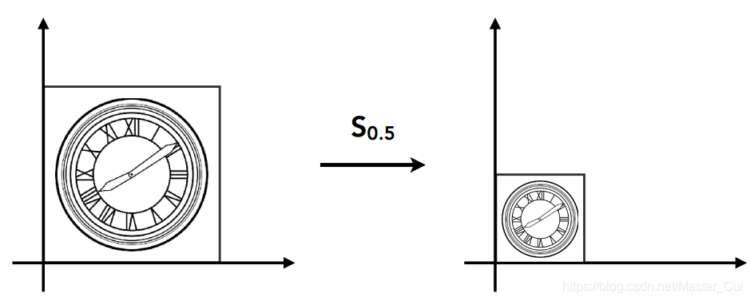

# 变换 Transformation
## 2D变换
- 缩放 Scale
  
$$
\begin{bmatrix}x'\\y'\end{bmatrix}=s\begin{bmatrix}x\\y\end{bmatrix}
$$
![[scale_2.png]]
$$
\begin{bmatrix}x'\\y'\end{bmatrix}=\begin{bmatrix}s_x&0\\0&s_y\end{bmatrix}\begin{bmatrix}x\\y\end{bmatrix}
$$
- 反射 Reflection
![[reflect.png]]
$$
\begin{bmatrix}x'\\y'\end{bmatrix}=\begin{bmatrix}-1&0\\0&1\end{bmatrix}\begin{bmatrix}x\\y\end{bmatrix}
$$
- 剪切 Shearing
![[shear.png]]
$$
\begin{gather}
x'=x+\frac{a}{b}y\\
y'=y\\
\begin{bmatrix}x'\\y'\end{bmatrix}=\begin{bmatrix}1&\frac{a}{b}\\0&1\end{bmatrix}\begin{bmatrix}x\\y\end{bmatrix}
\end{gather}
$$
- 旋转/逆时针 Rotation
![[rotate.png]]
$$
\begin{gather}
R_{\theta}=\begin{bmatrix}\cos\theta&-\sin\theta\\\sin\theta&\cos\theta\end{bmatrix}\\
R_{-\theta}=\begin{bmatrix}\cos\theta&\sin\theta\\-\sin\theta&\cos\theta\end{bmatrix}=R_{\theta}^T=R_{\theta}^{-1}
\end{gather}
$$
$R_\theta$ 为正交矩阵
- 平移 Translation
![[translation.png]]
$$
\begin{gather}
x^{'}=x+t_x\\
y^{'}=y+t_y\\
\begin{bmatrix}x^{'}\\y^{'}\end{bmatrix}=\begin{bmatrix}1&0\\0&1\end{bmatrix}\begin{bmatrix}x\\y\end{bmatrix}+\begin{bmatrix}t_x\\t_y\end{bmatrix}\\
\end{gather}
$$
使用齐次坐标
$$
\begin{bmatrix}x'\\y'\\1\end{bmatrix}=\begin{bmatrix}1&0&t_x\\0&1&t_y\\0&0&1\end{bmatrix}\begin{bmatrix}x\\y\\1\end{bmatrix}
$$
- 复合变换
  经过$A_0$ $A_1$ $A_2$ $A_3$ $...$ $A_n$几次变换为(右乘)
  $$
	p'=A_n\dots A_3A_2A_1A_0p
 $$
# 齐次坐标
