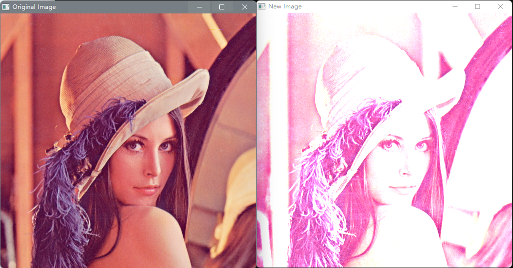

## 调整亮度和对比度

引用：[OpenCV: Changing the contrast and brightness of an image!](https://docs.opencv.org/4.5.5/d3/dc1/tutorial_basic_linear_transform.html)

### 像素线性变换

调整亮度和对比度是其中一种是像素的线性变换
$$
g(i,j)=\alpha f(i,j)+\beta
$$
参数$\alpha>0$和$\beta$称为增益(gian)参数和偏置(bias)参数，分别控制**对比度**和**亮度**

在OpenCV中实现

```cpp
for(int y = 0; y < image.rows; y++) 
    for(int x = 0; x < image.cols; x++) 
        for(int c = 0; c < image.channels(); c++) 
            new_image.at<cv::Vec3b>(y,x)[c] =
              saturate_cast<uchar>(alpha*image.at<cv::Vec3b>(y,x)[c] + beta);
```

需要对**每个像素的每个通道**进行线性运算

OpenCV中的`convertTo()`方法可以直接实现

```cpp
image.convertTo(new_image, -1, alpha, beta);
```

效果($\alpha=2.2$ $\beta=50$)



### Gamma校正

如果$\beta$的值过大/过小，像素的值会超出$[0，255]$的范围，超出255的值会被截断为255(过曝)，反之，低于0的值会被截断为0(曝光不足)

Gamma校正是一种非线性变换来校正图像的亮度![[Basic_Linear_Transform_Tutorial_gamma.png]]
$$
O=\left(\frac{I}{255}\right) ^\gamma\times255
$$


$\gamma<1$区域会变亮，反之$\gamma>1$区域会变暗

**对比**

- $\alpha=1.3,\beta=40$
![[Basic_Linear_Transform_Tutorial_linear_transform_correction.jpg]]
  亮度有所改善，但**云层过曝**

- $\gamma=0.4$
![[Basic_Linear_Transform_Tutorial_gamma_correction.jpg]]
Gamma校正OpenCV实现

```cpp
cv::Mat lookUpTable(1, 256, CV_8U);
uchar* p = lookUpTable.ptr();
for( int i = 0; i < 256; ++i)
    p[i] = saturate_cast<uchar>(pow(i / 255.0, gamma_) * 255.0);

Mat res = img.clone();
cv::LUT(img, lookUpTable, res);
```

`cv::LUT()`就是在`lookUpTable`中(一般是1*n的矩阵)中**查询img中的像素值对应序号所对应的值**，比如值为23就取表中23号对应的值(从0计数)，类似于`cv::convertTo()`，可以减少`for`循环(格式上)，速度也较其他方法快

## XML和YAML文件输入与输出

引用：[OpenCV: File Input and Output using XML and YAML files](https://docs.opencv.org/4.5.5/dd/d74/tutorial_file_input_output_with_xml_yml.html)

一些相对固定的数据组合(如**标定后得出的相机内参**，支持向量)可以存入XML和YAML等数据文件中，方便读取

OpenCV中的`cv::FileStorage`类提供了对数据文件操作的方法

### 写入/输出

```cpp
std::string filename = "outputfile.xml";	// xml/yml/yaml格式均可
// 设置输出文件名称和格式
// 或者在int main(int argc, char *argv[])下
// 运行时使用filename = arvg[1]指定输出名称和格式
// 参数为cv::FileStorage::WRITE
cv::FileStorage fs(filename, cv::FileStorage::WRITE);

// 给元素写入一对一的值
fs << "iterationNr" << 100;

// 给元素写入多个值，用"["-"]"表示一个字符序列
fs << "strings" << "[";
fs << "image1.jpg" << "Awesomeness" << "../data/baboon.jpg";
fs << "]"; 
// 或"{"-"}"表示一组映射
fs << "Mapping";
fs << "{" << "One" << 1;
fs <<        "Two" << 2 << "}";

// 对于opencv中cv::Mat可以直接写入
cv::Mat R = cv::Mat_<uchar>::eye(3, 3),
    	T = cv::Mat_<double>::zeros(3, 1);
fs << "R" << R;
fs << "T" << T;

// 对于类对象以及成员变量，需要事先进行函数重载(main函数之外 类代码略)
/* static void write(cv::FileStorage& fs, const std::string&, const MyData& x)
 * {
 *     fs << "{" << "A" << x.A << "X" << x.X << "id" << x.id << "}";
 * }
 */

Mydata m;
fs << "MyData" << m;

// 结束
fs.release();
```

输出文件

- xml

  ```xml
  <?xml version="1.0"?>
  <opencv_storage>
  <iterationNr>100</iterationNr>
  <strings>
    image1.jpg Awesomeness "../data/baboon.jpg"</strings>
  <Mapping>
    <One>1</One>
    <Two>2</Two></Mapping>
  <R type_id="opencv-matrix">
    <rows>3</rows>
    <cols>3</cols>
    <dt>u</dt>
    <data>
      1 0 0 0 1 0 0 0 1</data></R>
  <T type_id="opencv-matrix">
    <rows>3</rows>
    <cols>1</cols>
    <dt>d</dt>
    <data>
      0. 0. 0.</data></T>
  <MyData>
    <A>97</A>
    <X>3.1415926535897931e+00</X>
    <id>mydata1234</id></MyData>
  </opencv_storage>
  ```

- yaml/yml

  ```yaml
  %YAML:1.0
  ---
  iterationNr: 100
  strings:
     - "image1.jpg"
     - Awesomeness
     - "../data/baboon.jpg"
  Mapping:
     One: 1
     Two: 2
  R: !!opencv-matrix
     rows: 3
     cols: 3
     dt: u
     data: [ 1, 0, 0, 0, 1, 0, 0, 0, 1 ]
  T: !!opencv-matrix
     rows: 3
     cols: 1
     dt: d
     data: [ 0., 0., 0. ]
  MyData:
     A: 97
     X: 3.1415926535897931e+00
     id: mydata1234
  ```

其中在`cv::Mat`的存储格式中，`rows`和`cols`表示矩阵的形状，`dt`表示矩阵的数据类型，`data`依次表示各个元素的值

### 读取/输入

```cpp
// 与写入的格式基本相同，将参数换为cv::FileStorage::READ
std::string filename = "outputfile.xml";
cv::FileStorage fs(filename, cv::FileStorage::READ);

//对于一对一的，直接使用fs["对应的名称"]即可
int itNr;
itNr = (int) fs["iterationNr"];	//做一次强制类型转换以确保数据类型对应
// 或
fs["iterationNr"] >> itNr;

// 对应一对多的数据(序列，映射)， 可以先将主体传给cv::FileNode对象
cv::FileNode n = fs["strings"];
// 对于序列，可以使用迭代器cv::FileNodeIterator,类似于C++自己的迭代器
cv::FileNodeIterator it = n.begin();
for (; it != n.end(); ++it)
    std::cout << (std::string)*it << std::endl;
// 对于映射，可以按多维数组形式输出
n = fs["Mapping"];
std::cout << "Two  " << (int)(n["Two"]) << "; ";
std::cout << "One  " << (int)(n["One"]) << std::endl << std::endl;
// 或者以多维数值的形式(注意越界问题)
std::cout << (std::string)fs["strings"][0] << std::endl;
// 而映射只能使用对应的标签(不存在越界)
std::cout << (std::string)fs["Mapping"]["One"] << std::endl;

// cv::Mat可以直接使用
cv::Mat R, T;
fs["R"] >> R;
fs["T"] >> T;	// 不能使用T = fs["T"]; 但可以设置运算符重载
std::cout << "R = \n" << R << std::endl;
std::cout << "T = \n" << T.t() << std::endl;

// 对于类对象也需要做一次运算符重载
/* static void read(const cv::FileNode& node, MyData& x, const MyData&default_value = MyData()){
 *     x.A = (int)node["A"];
 *     x.X = (double)node["X"];
 *     x.id = (std::string)node["id"];
 * } */
MyData m;
fs["MyData"] >> m;
std::cout << "{ id = " << m.id << ", ";
std::cout << "X = " << m.X << ", ";
std::cout << "A = " << m.A << "}" << std::endl;
```

输出

```
image1.jpg
Awesomeness
../data/baboon.jpg
Two  2; One  1

image1.jpg

R =
[  1,   0,   0;
   0,   1,   0;
   0,   0,   1]
T =
[0, 0, 0]
{ id = mydata1234, X = 3.14159, A = 97}
```

### 实例

*camera.xml*文件存放相机内参和畸变参数

```xml
<?xml version="1.0" encoding="utf-8"?>
<opencv_storage>
   <Camera_Matrix type_id="opencv-matrix">
      <rows>3</rows>
      <cols>3</cols>
      <dt>d</dt>
      <data>5.0290687772057061e+02 0. 320. 0. 5.0290687772057061e+02 180. 0. 0.
    1.
</data>
   </Camera_Matrix>
   <Distortion_Coefficients type_id="opencv-matrix">
      <rows>5</rows>
      <cols>1</cols>
      <dt>d</dt>
      <data>1.0956640124470347e-01 -2.7487270050352164e-01 0. 0.
    3.3373532641246206e-01 </data>
   </Distortion_Coefficients>
</opencv_storage>
```

读取

```cpp
int main(int argc, char *argv[])
{
    std::string filename = "camera.xml";
    cv::FileStorage fs(filename, cv::FileStorage::READ);

    cv::Mat cam_mat;
    fs["Camera_Matrix"] >> cam_mat;
    std::cout << "Camera_Matrix = \n" << cam_mat << std::endl;
    
    cv::Mat dis_coeff;
    fs["Distortion_Coefficients"] >> dis_coeff;
    std::cout << "Distortion_Coefficients = \n" << dis_coeff.t() << std::endl;
}
```

输出

 ```
 Camera_Matrix =
 [502.9068777205706, 0, 320;
  0, 502.9068777205706, 180;
  0, 0, 1]
 Distortion_Coefficients =
 [0.1095664012447035, -0.2748727005035216, 0, 0, 0.3337353264124621]
 ```

## Look-Up Table(LUT)

引用：[OpenCV: How to scan images, lookup tables and time measurement with OpenCV](https://docs.opencv.org/4.5.5/db/da5/tutorial_how_to_scan_images.html)


## 相机标定(棋盘图)

OpenCV支持三种类型的对象进行校准：‎

- ‎古典黑白棋盘‎
- ‎对称圆图案‎
- ‎不对称圆形图案‎


- **径向畸变**(由于镜片的形状引起的)
  $$
  x_{distorted}=x(1+k_1r^2+k_2r^4+k_3r^6)\\
  y_{distorted}=y(1+k_1r^2+k_2r^4+k_3r^6)
  $$

- **切向畸变**(由于镜片与成像平面不平行引起的)
  $$
  x_{distorted}=x+[2p_1xy+p_2(r^2+2x^2)]\\
  y_{distorted}=y+[p_1(r^2+2y^2)+2p_2xy]
  $$

其中$r$表示某个像素到图像中心的距离

在OpenCV中得到的畸变参数由1*5的矩阵储存
$$
distortion\_coefficients=(k_1\ k_2\ p_1\ p_2\ k_3)
$$

- 相机内参
  $$
  \begin{bmatrix}x\\y\\w\end{bmatrix}=
  \begin{bmatrix}f_x&0&c_x\\f_y&0&c_y\\0&0&1\end{bmatrix}\begin{bmatrix}X\\Y\\Z\end{bmatrix}
  $$

‎基本上，需要用相机拍摄这些标定模式的照片，要求解方程，至少需要预定数量的模式照片才能形成一个良构方程组。对于棋盘模式，这个数字较高。从理论上讲，棋盘模式至少需要两个照片。然而，在实践中，因此为了获得良好的结果，可能**需要至少10个不同位置的输入模式的良好照片**

### OpenCV提供的标定代码

```cpp
#include <iostream>
#include <sstream>
#include <string>
#include <ctime>
#include <cstdio>

#include <opencv2/core.hpp>
#include <opencv2/core/utility.hpp>
#include <opencv2/imgproc.hpp>
#include <opencv2/calib3d.hpp>
#include <opencv2/imgcodecs.hpp>
#include <opencv2/videoio.hpp>
#include <opencv2/highgui.hpp>

using namespace cv;
using namespace std;

class Settings
{
public:
    Settings() : goodInput(false) {}
    enum Pattern { NOT_EXISTING, CHESSBOARD, CIRCLES_GRID, ASYMMETRIC_CIRCLES_GRID };
    enum InputType { INVALID, CAMERA, VIDEO_FILE, IMAGE_LIST };

    void write(FileStorage& fs) const                        //Write serialization for this class
    {
        fs << "{"
                  << "BoardSize_Width"  << boardSize.width
                  << "BoardSize_Height" << boardSize.height
                  << "Square_Size"         << squareSize
                  << "Calibrate_Pattern" << patternToUse
                  << "Calibrate_NrOfFrameToUse" << nrFrames
                  << "Calibrate_FixAspectRatio" << aspectRatio
                  << "Calibrate_AssumeZeroTangentialDistortion" << calibZeroTangentDist
                  << "Calibrate_FixPrincipalPointAtTheCenter" << calibFixPrincipalPoint

                  << "Write_DetectedFeaturePoints" << writePoints
                  << "Write_extrinsicParameters"   << writeExtrinsics
                  << "Write_gridPoints" << writeGrid
                  << "Write_outputFileName"  << outputFileName

                  << "Show_UndistortedImage" << showUndistorted

                  << "Input_FlipAroundHorizontalAxis" << flipVertical
                  << "Input_Delay" << delay
                  << "Input" << input
           << "}";
    }
    void read(const FileNode& node)                          //Read serialization for this class
    {
        node["BoardSize_Width" ] >> boardSize.width;
        node["BoardSize_Height"] >> boardSize.height;
        node["Calibrate_Pattern"] >> patternToUse;
        node["Square_Size"]  >> squareSize;
        node["Calibrate_NrOfFrameToUse"] >> nrFrames;
        node["Calibrate_FixAspectRatio"] >> aspectRatio;
        node["Write_DetectedFeaturePoints"] >> writePoints;
        node["Write_extrinsicParameters"] >> writeExtrinsics;
        node["Write_gridPoints"] >> writeGrid;
        node["Write_outputFileName"] >> outputFileName;
        node["Calibrate_AssumeZeroTangentialDistortion"] >> calibZeroTangentDist;
        node["Calibrate_FixPrincipalPointAtTheCenter"] >> calibFixPrincipalPoint;
        node["Calibrate_UseFisheyeModel"] >> useFisheye;
        node["Input_FlipAroundHorizontalAxis"] >> flipVertical;
        node["Show_UndistortedImage"] >> showUndistorted;
        node["Input"] >> input;
        node["Input_Delay"] >> delay;
        node["Fix_K1"] >> fixK1;
        node["Fix_K2"] >> fixK2;
        node["Fix_K3"] >> fixK3;
        node["Fix_K4"] >> fixK4;
        node["Fix_K5"] >> fixK5;

        validate();
    }
    void validate()
    {
        goodInput = true;
        if (boardSize.width <= 0 || boardSize.height <= 0)
        {
            cerr << "Invalid Board size: " << boardSize.width << " " << boardSize.height << endl;
            goodInput = false;
        }
        if (squareSize <= 10e-6)
        {
            cerr << "Invalid square size " << squareSize << endl;
            goodInput = false;
        }
        if (nrFrames <= 0)
        {
            cerr << "Invalid number of frames " << nrFrames << endl;
            goodInput = false;
        }

        if (input.empty())      // Check for valid input
                inputType = INVALID;
        else
        {
            if (input[0] >= '0' && input[0] <= '9')
            {
                stringstream ss(input);
                ss >> cameraID;
                inputType = CAMERA;
            }
            else
            {
                if (isListOfImages(input) && readStringList(input, imageList))
                {
                    inputType = IMAGE_LIST;
                    nrFrames = (nrFrames < (int)imageList.size()) ? nrFrames : (int)imageList.size();
                }
                else
                    inputType = VIDEO_FILE;
            }
            if (inputType == CAMERA)
                inputCapture.open(cameraID);
            if (inputType == VIDEO_FILE)
                inputCapture.open(input);
            if (inputType != IMAGE_LIST && !inputCapture.isOpened())
                    inputType = INVALID;
        }
        if (inputType == INVALID)
        {
            cerr << " Input does not exist: " << input;
            goodInput = false;
        }

        flag = 0;
        if(calibFixPrincipalPoint) flag |= CALIB_FIX_PRINCIPAL_POINT;
        if(calibZeroTangentDist)   flag |= CALIB_ZERO_TANGENT_DIST;
        if(aspectRatio)            flag |= CALIB_FIX_ASPECT_RATIO;
        if(fixK1)                  flag |= CALIB_FIX_K1;
        if(fixK2)                  flag |= CALIB_FIX_K2;
        if(fixK3)                  flag |= CALIB_FIX_K3;
        if(fixK4)                  flag |= CALIB_FIX_K4;
        if(fixK5)                  flag |= CALIB_FIX_K5;

        if (useFisheye) {
            // the fisheye model has its own enum, so overwrite the flags
            flag = fisheye::CALIB_FIX_SKEW | fisheye::CALIB_RECOMPUTE_EXTRINSIC;
            if(fixK1)                   flag |= fisheye::CALIB_FIX_K1;
            if(fixK2)                   flag |= fisheye::CALIB_FIX_K2;
            if(fixK3)                   flag |= fisheye::CALIB_FIX_K3;
            if(fixK4)                   flag |= fisheye::CALIB_FIX_K4;
            if (calibFixPrincipalPoint) flag |= fisheye::CALIB_FIX_PRINCIPAL_POINT;
        }

        calibrationPattern = NOT_EXISTING;
        if (!patternToUse.compare("CHESSBOARD")) calibrationPattern = CHESSBOARD;
        if (!patternToUse.compare("CIRCLES_GRID")) calibrationPattern = CIRCLES_GRID;
        if (!patternToUse.compare("ASYMMETRIC_CIRCLES_GRID")) calibrationPattern = ASYMMETRIC_CIRCLES_GRID;
        if (calibrationPattern == NOT_EXISTING)
        {
            cerr << " Camera calibration mode does not exist: " << patternToUse << endl;
            goodInput = false;
        }
        atImageList = 0;

    }
    Mat nextImage()
    {
        Mat result;
        if( inputCapture.isOpened() )
        {
            Mat view0;
            inputCapture >> view0;
            view0.copyTo(result);
        }
        else if( atImageList < imageList.size() )
            result = imread(imageList[atImageList++], IMREAD_COLOR);

        return result;
    }

    static bool readStringList( const string& filename, vector<string>& l )
    {
        l.clear();
        FileStorage fs(filename, FileStorage::READ);
        if( !fs.isOpened() )
            return false;
        FileNode n = fs.getFirstTopLevelNode();
        if( n.type() != FileNode::SEQ )
            return false;
        FileNodeIterator it = n.begin(), it_end = n.end();
        for( ; it != it_end; ++it )
            l.push_back((string)*it);
        return true;
    }

    static bool isListOfImages( const string& filename)
    {
        string s(filename);
        // Look for file extension
        if( s.find(".xml") == string::npos && s.find(".yaml") == string::npos && s.find(".yml") == string::npos )
            return false;
        else
            return true;
    }
public:
    Size boardSize;              // The size of the board -> Number of items by width and height
    Pattern calibrationPattern;  // One of the Chessboard, circles, or asymmetric circle pattern
    float squareSize;            // The size of a square in your defined unit (point, millimeter,etc).
    int nrFrames;                // The number of frames to use from the input for calibration
    float aspectRatio;           // The aspect ratio
    int delay;                   // In case of a video input
    bool writePoints;            // Write detected feature points
    bool writeExtrinsics;        // Write extrinsic parameters
    bool writeGrid;              // Write refined 3D target grid points
    bool calibZeroTangentDist;   // Assume zero tangential distortion
    bool calibFixPrincipalPoint; // Fix the principal point at the center
    bool flipVertical;           // Flip the captured images around the horizontal axis
    string outputFileName;       // The name of the file where to write
    bool showUndistorted;        // Show undistorted images after calibration
    string input;                // The input ->
    bool useFisheye;             // use fisheye camera model for calibration
    bool fixK1;                  // fix K1 distortion coefficient
    bool fixK2;                  // fix K2 distortion coefficient
    bool fixK3;                  // fix K3 distortion coefficient
    bool fixK4;                  // fix K4 distortion coefficient
    bool fixK5;                  // fix K5 distortion coefficient

    int cameraID;
    vector<string> imageList;
    size_t atImageList;
    VideoCapture inputCapture;
    InputType inputType;
    bool goodInput;
    int flag;

private:
    string patternToUse;


};

static inline void read(const FileNode& node, Settings& x, const Settings& default_value = Settings())
{
    if(node.empty())
        x = default_value;
    else
        x.read(node);
}

enum { DETECTION = 0, CAPTURING = 1, CALIBRATED = 2 };

bool runCalibrationAndSave(Settings& s, Size imageSize, Mat&  cameraMatrix, Mat& distCoeffs,
                           vector<vector<Point2f> > imagePoints, float grid_width, bool release_object);

int main(int argc, char* argv[])
{
    const String keys
        = "{help h usage ? |           | print this message            }"
          "{@settings      |default.xml| input setting file            }"
          "{d              |           | actual distance between top-left and top-right corners of "
          "the calibration grid }"
          "{winSize        | 11        | Half of search window for cornerSubPix }";
    CommandLineParser parser(argc, argv, keys);
    parser.about("This is a camera calibration sample.\n"
                 "Usage: camera_calibration [configuration_file -- default ./default.xml]\n"
                 "Near the sample file you'll find the configuration file, which has detailed help of "
                 "how to edit it. It may be any OpenCV supported file format XML/YAML.");
    if (!parser.check()) {
        parser.printErrors();
        return 0;
    }

    if (parser.has("help")) {
        parser.printMessage();
        return 0;
    }

    //! [file_read]
    Settings s;
    const string inputSettingsFile = parser.get<string>(0);
    FileStorage fs(inputSettingsFile, FileStorage::READ); // Read the settings
    if (!fs.isOpened())
    {
        cout << "Could not open the configuration file: \"" << inputSettingsFile << "\"" << endl;
        parser.printMessage();
        return -1;
    }
    fs["Settings"] >> s;
    fs.release();                                         // close Settings file
    //! [file_read]

    //FileStorage fout("settings.yml", FileStorage::WRITE); // write config as YAML
    //fout << "Settings" << s;

    if (!s.goodInput)
    {
        cout << "Invalid input detected. Application stopping. " << endl;
        return -1;
    }

    int winSize = parser.get<int>("winSize");

    float grid_width = s.squareSize * (s.boardSize.width - 1);
    bool release_object = false;
    if (parser.has("d")) {
        grid_width = parser.get<float>("d");
        release_object = true;
    }

    vector<vector<Point2f> > imagePoints;
    Mat cameraMatrix, distCoeffs;
    Size imageSize;
    int mode = s.inputType == Settings::IMAGE_LIST ? CAPTURING : DETECTION;
    clock_t prevTimestamp = 0;
    const Scalar RED(0,0,255), GREEN(0,255,0);
    const char ESC_KEY = 27;

    //! [get_input]
    for(;;)
    {
        Mat view;
        bool blinkOutput = false;

        view = s.nextImage();

        //-----  If no more image, or got enough, then stop calibration and show result -------------
        if( mode == CAPTURING && imagePoints.size() >= (size_t)s.nrFrames )
        {
          if(runCalibrationAndSave(s, imageSize,  cameraMatrix, distCoeffs, imagePoints, grid_width,
                                   release_object))
              mode = CALIBRATED;
          else
              mode = DETECTION;
        }
        if(view.empty())          // If there are no more images stop the loop
        {
            // if calibration threshold was not reached yet, calibrate now
            if( mode != CALIBRATED && !imagePoints.empty() )
                runCalibrationAndSave(s, imageSize,  cameraMatrix, distCoeffs, imagePoints, grid_width,
                                      release_object);
            break;
        }
        //! [get_input]

        imageSize = view.size();  // Format input image.
        if( s.flipVertical )    flip( view, view, 0 );

        //! [find_pattern]
        vector<Point2f> pointBuf;

        bool found;

        int chessBoardFlags = CALIB_CB_ADAPTIVE_THRESH | CALIB_CB_NORMALIZE_IMAGE;

        if(!s.useFisheye) {
            // fast check erroneously fails with high distortions like fisheye
            chessBoardFlags |= CALIB_CB_FAST_CHECK;
        }

        switch( s.calibrationPattern ) // Find feature points on the input format
        {
        case Settings::CHESSBOARD:
            found = findChessboardCorners( view, s.boardSize, pointBuf, chessBoardFlags);
            break;
        case Settings::CIRCLES_GRID:
            found = findCirclesGrid( view, s.boardSize, pointBuf );
            break;
        case Settings::ASYMMETRIC_CIRCLES_GRID:
            found = findCirclesGrid( view, s.boardSize, pointBuf, CALIB_CB_ASYMMETRIC_GRID );
            break;
        default:
            found = false;
            break;
        }
        //! [find_pattern]
        //! [pattern_found]
        if ( found)                // If done with success,
        {
              // improve the found corners' coordinate accuracy for chessboard
                if( s.calibrationPattern == Settings::CHESSBOARD)
                {
                    Mat viewGray;
                    cvtColor(view, viewGray, COLOR_BGR2GRAY);
                    cornerSubPix( viewGray, pointBuf, Size(winSize,winSize),
                        Size(-1,-1), TermCriteria( TermCriteria::EPS+TermCriteria::COUNT, 30, 0.0001 ));
                }

                if( mode == CAPTURING &&  // For camera only take new samples after delay time
                    (!s.inputCapture.isOpened() || clock() - prevTimestamp > s.delay*1e-3*CLOCKS_PER_SEC) )
                {
                    imagePoints.push_back(pointBuf);
                    prevTimestamp = clock();
                    blinkOutput = s.inputCapture.isOpened();
                }

                // Draw the corners.
                drawChessboardCorners( view, s.boardSize, Mat(pointBuf), found );
        }
        //! [pattern_found]
        //----------------------------- Output Text ------------------------------------------------
        //! [output_text]
        string msg = (mode == CAPTURING) ? "100/100" :
                      mode == CALIBRATED ? "Calibrated" : "Press 'g' to start";
        int baseLine = 0;
        Size textSize = getTextSize(msg, 1, 1, 1, &baseLine);
        Point textOrigin(view.cols - 2*textSize.width - 10, view.rows - 2*baseLine - 10);

        if( mode == CAPTURING )
        {
            if(s.showUndistorted)
                msg = cv::format( "%d/%d Undist", (int)imagePoints.size(), s.nrFrames );
            else
                msg = cv::format( "%d/%d", (int)imagePoints.size(), s.nrFrames );
        }

        putText( view, msg, textOrigin, 1, 1, mode == CALIBRATED ?  GREEN : RED);

        if( blinkOutput )
            bitwise_not(view, view);
        //! [output_text]
        //------------------------- Video capture  output  undistorted ------------------------------
        //! [output_undistorted]
        if( mode == CALIBRATED && s.showUndistorted )
        {
            Mat temp = view.clone();
            if (s.useFisheye)
            {
                Mat newCamMat;
                fisheye::estimateNewCameraMatrixForUndistortRectify(cameraMatrix, distCoeffs, imageSize,
                                                                    Matx33d::eye(), newCamMat, 1);
                cv::fisheye::undistortImage(temp, view, cameraMatrix, distCoeffs, newCamMat);
            }
            else
              undistort(temp, view, cameraMatrix, distCoeffs);
        }
        //! [output_undistorted]
        //------------------------------ Show image and check for input commands -------------------
        //! [await_input]
        imshow("Image View", view);
        char key = (char)waitKey(s.inputCapture.isOpened() ? 50 : s.delay);

        if( key  == ESC_KEY )
            break;

        if( key == 'u' && mode == CALIBRATED )
           s.showUndistorted = !s.showUndistorted;

        if( s.inputCapture.isOpened() && key == 'g' )
        {
            mode = CAPTURING;
            imagePoints.clear();
        }
        //! [await_input]
    }

    // -----------------------Show the undistorted image for the image list ------------------------
    //! [show_results]
    if( s.inputType == Settings::IMAGE_LIST && s.showUndistorted && !cameraMatrix.empty())
    {
        Mat view, rview, map1, map2;

        if (s.useFisheye)
        {
            Mat newCamMat;
            fisheye::estimateNewCameraMatrixForUndistortRectify(cameraMatrix, distCoeffs, imageSize,
                                                                Matx33d::eye(), newCamMat, 1);
            fisheye::initUndistortRectifyMap(cameraMatrix, distCoeffs, Matx33d::eye(), newCamMat, imageSize,
                                             CV_16SC2, map1, map2);
        }
        else
        {
            initUndistortRectifyMap(
                cameraMatrix, distCoeffs, Mat(),
                getOptimalNewCameraMatrix(cameraMatrix, distCoeffs, imageSize, 1, imageSize, 0), imageSize,
                CV_16SC2, map1, map2);
        }

        for(size_t i = 0; i < s.imageList.size(); i++ )
        {
            view = imread(s.imageList[i], IMREAD_COLOR);
            if(view.empty())
                continue;
            remap(view, rview, map1, map2, INTER_LINEAR);
            imshow("Image View", rview);
            char c = (char)waitKey();
            if( c  == ESC_KEY || c == 'q' || c == 'Q' )
                break;
        }
    }
    //! [show_results]

    return 0;
}

//! [compute_errors]
static double computeReprojectionErrors( const vector<vector<Point3f> >& objectPoints,
                                         const vector<vector<Point2f> >& imagePoints,
                                         const vector<Mat>& rvecs, const vector<Mat>& tvecs,
                                         const Mat& cameraMatrix , const Mat& distCoeffs,
                                         vector<float>& perViewErrors, bool fisheye)
{
    vector<Point2f> imagePoints2;
    size_t totalPoints = 0;
    double totalErr = 0, err;
    perViewErrors.resize(objectPoints.size());

    for(size_t i = 0; i < objectPoints.size(); ++i )
    {
        if (fisheye)
        {
            fisheye::projectPoints(objectPoints[i], imagePoints2, rvecs[i], tvecs[i], cameraMatrix,
                                   distCoeffs);
        }
        else
        {
            projectPoints(objectPoints[i], rvecs[i], tvecs[i], cameraMatrix, distCoeffs, imagePoints2);
        }
        err = norm(imagePoints[i], imagePoints2, NORM_L2);

        size_t n = objectPoints[i].size();
        perViewErrors[i] = (float) std::sqrt(err*err/n);
        totalErr        += err*err;
        totalPoints     += n;
    }

    return std::sqrt(totalErr/totalPoints);
}
//! [compute_errors]
//! [board_corners]
static void calcBoardCornerPositions(Size boardSize, float squareSize, vector<Point3f>& corners,
                                     Settings::Pattern patternType /*= Settings::CHESSBOARD*/)
{
    corners.clear();

    switch(patternType)
    {
    case Settings::CHESSBOARD:
    case Settings::CIRCLES_GRID:
        for( int i = 0; i < boardSize.height; ++i )
            for( int j = 0; j < boardSize.width; ++j )
                corners.push_back(Point3f(j*squareSize, i*squareSize, 0));
        break;

    case Settings::ASYMMETRIC_CIRCLES_GRID:
        for( int i = 0; i < boardSize.height; i++ )
            for( int j = 0; j < boardSize.width; j++ )
                corners.push_back(Point3f((2*j + i % 2)*squareSize, i*squareSize, 0));
        break;
    default:
        break;
    }
}
//! [board_corners]
static bool runCalibration( Settings& s, Size& imageSize, Mat& cameraMatrix, Mat& distCoeffs,
                            vector<vector<Point2f> > imagePoints, vector<Mat>& rvecs, vector<Mat>& tvecs,
                            vector<float>& reprojErrs,  double& totalAvgErr, vector<Point3f>& newObjPoints,
                            float grid_width, bool release_object)
{
    //! [fixed_aspect]
    cameraMatrix = Mat::eye(3, 3, CV_64F);
    if( !s.useFisheye && s.flag & CALIB_FIX_ASPECT_RATIO )
        cameraMatrix.at<double>(0,0) = s.aspectRatio;
    //! [fixed_aspect]
    if (s.useFisheye) {
        distCoeffs = Mat::zeros(4, 1, CV_64F);
    } else {
        distCoeffs = Mat::zeros(8, 1, CV_64F);
    }

    vector<vector<Point3f> > objectPoints(1);
    calcBoardCornerPositions(s.boardSize, s.squareSize, objectPoints[0], s.calibrationPattern);
    objectPoints[0][s.boardSize.width - 1].x = objectPoints[0][0].x + grid_width;
    newObjPoints = objectPoints[0];

    objectPoints.resize(imagePoints.size(),objectPoints[0]);

    //Find intrinsic and extrinsic camera parameters
    double rms;

    if (s.useFisheye) {
        Mat _rvecs, _tvecs;
        rms = fisheye::calibrate(objectPoints, imagePoints, imageSize, cameraMatrix, distCoeffs, _rvecs,
                                 _tvecs, s.flag);

        rvecs.reserve(_rvecs.rows);
        tvecs.reserve(_tvecs.rows);
        for(int i = 0; i < int(objectPoints.size()); i++){
            rvecs.push_back(_rvecs.row(i));
            tvecs.push_back(_tvecs.row(i));
        }
    } else {
        int iFixedPoint = -1;
        if (release_object)
            iFixedPoint = s.boardSize.width - 1;
        rms = calibrateCameraRO(objectPoints, imagePoints, imageSize, iFixedPoint,
                                cameraMatrix, distCoeffs, rvecs, tvecs, newObjPoints,
                                s.flag | CALIB_USE_LU);
    }

    if (release_object) {
        cout << "New board corners: " << endl;
        cout << newObjPoints[0] << endl;
        cout << newObjPoints[s.boardSize.width - 1] << endl;
        cout << newObjPoints[s.boardSize.width * (s.boardSize.height - 1)] << endl;
        cout << newObjPoints.back() << endl;
    }

    cout << "Re-projection error reported by calibrateCamera: "<< rms << endl;

    bool ok = checkRange(cameraMatrix) && checkRange(distCoeffs);

    objectPoints.clear();
    objectPoints.resize(imagePoints.size(), newObjPoints);
    totalAvgErr = computeReprojectionErrors(objectPoints, imagePoints, rvecs, tvecs, cameraMatrix,
                                            distCoeffs, reprojErrs, s.useFisheye);

    return ok;
}

// Print camera parameters to the output file
static void saveCameraParams( Settings& s, Size& imageSize, Mat& cameraMatrix, Mat& distCoeffs,
                              const vector<Mat>& rvecs, const vector<Mat>& tvecs,
                              const vector<float>& reprojErrs, const vector<vector<Point2f> >& imagePoints,
                              double totalAvgErr, const vector<Point3f>& newObjPoints )
{
    FileStorage fs( s.outputFileName, FileStorage::WRITE );

    time_t tm;
    time( &tm );
    struct tm *t2 = localtime( &tm );
    char buf[1024];
    strftime( buf, sizeof(buf), "%c", t2 );

    fs << "calibration_time" << buf;

    if( !rvecs.empty() || !reprojErrs.empty() )
        fs << "nr_of_frames" << (int)std::max(rvecs.size(), reprojErrs.size());
    fs << "image_width" << imageSize.width;
    fs << "image_height" << imageSize.height;
    fs << "board_width" << s.boardSize.width;
    fs << "board_height" << s.boardSize.height;
    fs << "square_size" << s.squareSize;

    if( !s.useFisheye && s.flag & CALIB_FIX_ASPECT_RATIO )
        fs << "fix_aspect_ratio" << s.aspectRatio;

    if (s.flag)
    {
        std::stringstream flagsStringStream;
        if (s.useFisheye)
        {
            flagsStringStream << "flags:"
                << (s.flag & fisheye::CALIB_FIX_SKEW ? " +fix_skew" : "")
                << (s.flag & fisheye::CALIB_FIX_K1 ? " +fix_k1" : "")
                << (s.flag & fisheye::CALIB_FIX_K2 ? " +fix_k2" : "")
                << (s.flag & fisheye::CALIB_FIX_K3 ? " +fix_k3" : "")
                << (s.flag & fisheye::CALIB_FIX_K4 ? " +fix_k4" : "")
                << (s.flag & fisheye::CALIB_RECOMPUTE_EXTRINSIC ? " +recompute_extrinsic" : "");
        }
        else
        {
            flagsStringStream << "flags:"
                << (s.flag & CALIB_USE_INTRINSIC_GUESS ? " +use_intrinsic_guess" : "")
                << (s.flag & CALIB_FIX_ASPECT_RATIO ? " +fix_aspectRatio" : "")
                << (s.flag & CALIB_FIX_PRINCIPAL_POINT ? " +fix_principal_point" : "")
                << (s.flag & CALIB_ZERO_TANGENT_DIST ? " +zero_tangent_dist" : "")
                << (s.flag & CALIB_FIX_K1 ? " +fix_k1" : "")
                << (s.flag & CALIB_FIX_K2 ? " +fix_k2" : "")
                << (s.flag & CALIB_FIX_K3 ? " +fix_k3" : "")
                << (s.flag & CALIB_FIX_K4 ? " +fix_k4" : "")
                << (s.flag & CALIB_FIX_K5 ? " +fix_k5" : "");
        }
        fs.writeComment(flagsStringStream.str());
    }

    fs << "flags" << s.flag;

    fs << "fisheye_model" << s.useFisheye;

    fs << "camera_matrix" << cameraMatrix;
    fs << "distortion_coefficients" << distCoeffs;

    fs << "avg_reprojection_error" << totalAvgErr;
    if (s.writeExtrinsics && !reprojErrs.empty())
        fs << "per_view_reprojection_errors" << Mat(reprojErrs);

    if(s.writeExtrinsics && !rvecs.empty() && !tvecs.empty() )
    {
        CV_Assert(rvecs[0].type() == tvecs[0].type());
        Mat bigmat((int)rvecs.size(), 6, CV_MAKETYPE(rvecs[0].type(), 1));
        bool needReshapeR = rvecs[0].depth() != 1 ? true : false;
        bool needReshapeT = tvecs[0].depth() != 1 ? true : false;

        for( size_t i = 0; i < rvecs.size(); i++ )
        {
            Mat r = bigmat(Range(int(i), int(i+1)), Range(0,3));
            Mat t = bigmat(Range(int(i), int(i+1)), Range(3,6));

            if(needReshapeR)
                rvecs[i].reshape(1, 1).copyTo(r);
            else
            {
                //*.t() is MatExpr (not Mat) so we can use assignment operator
                CV_Assert(rvecs[i].rows == 3 && rvecs[i].cols == 1);
                r = rvecs[i].t();
            }

            if(needReshapeT)
                tvecs[i].reshape(1, 1).copyTo(t);
            else
            {
                CV_Assert(tvecs[i].rows == 3 && tvecs[i].cols == 1);
                t = tvecs[i].t();
            }
        }
        fs.writeComment("a set of 6-tuples (rotation vector + translation vector) for each view");
        fs << "extrinsic_parameters" << bigmat;
    }

    if(s.writePoints && !imagePoints.empty() )
    {
        Mat imagePtMat((int)imagePoints.size(), (int)imagePoints[0].size(), CV_32FC2);
        for( size_t i = 0; i < imagePoints.size(); i++ )
        {
            Mat r = imagePtMat.row(int(i)).reshape(2, imagePtMat.cols);
            Mat imgpti(imagePoints[i]);
            imgpti.copyTo(r);
        }
        fs << "image_points" << imagePtMat;
    }

    if( s.writeGrid && !newObjPoints.empty() )
    {
        fs << "grid_points" << newObjPoints;
    }
}

//! [run_and_save]
bool runCalibrationAndSave(Settings& s, Size imageSize, Mat& cameraMatrix, Mat& distCoeffs,
                           vector<vector<Point2f> > imagePoints, float grid_width, bool release_object)
{
    vector<Mat> rvecs, tvecs;
    vector<float> reprojErrs;
    double totalAvgErr = 0;
    vector<Point3f> newObjPoints;

    bool ok = runCalibration(s, imageSize, cameraMatrix, distCoeffs, imagePoints, rvecs, tvecs, reprojErrs,
                             totalAvgErr, newObjPoints, grid_width, release_object);
    cout << (ok ? "Calibration succeeded" : "Calibration failed")
         << ". avg re projection error = " << totalAvgErr << endl;

    if (ok)
        saveCameraParams(s, imageSize, cameraMatrix, distCoeffs, rvecs, tvecs, reprojErrs, imagePoints,
                         totalAvgErr, newObjPoints);
    return ok;
}
```

**setting.xml**

```xml
<?xml version="1.0"?>
<opencv_storage>
<Settings>
  <!-- Number of inner corners per a item row and column. (square, circle) -->
  <BoardSize_Width> 9</BoardSize_Width>
  <BoardSize_Height>6</BoardSize_Height>
  
  <!-- The size of a square in some user defined metric system (pixel, millimeter)-->
  <Square_Size>24.5</Square_Size>
  
  <!-- The type of input used for camera calibration. One of: CHESSBOARD CIRCLES_GRID ASYMMETRIC_CIRCLES_GRID -->
  <Calibrate_Pattern>"CHESSBOARD"</Calibrate_Pattern>
  
  <!-- The input to use for calibration. 
		To use an input camera -> give the ID of the camera, like "1"
		To use an input video  -> give the path of the input video, like "/tmp/x.avi"
		To use an image list   -> give the path to the XML or YAML file containing the list of the images, like "/tmp/circles_list.xml"
		-->
  <Input>"0"</Input>
  <!--  If true (non-zero) we flip the input images around the horizontal axis.-->
  <Input_FlipAroundHorizontalAxis>0</Input_FlipAroundHorizontalAxis>
  
  <!-- Time delay between frames in case of camera. -->
  <Input_Delay>1000</Input_Delay>	
  
  <!-- How many frames to use, for calibration. -->
  <Calibrate_NrOfFrameToUse>25</Calibrate_NrOfFrameToUse>
  <!-- Consider only fy as a free parameter, the ratio fx/fy stays the same as in the input cameraMatrix. 
	   Use or not setting. 0 - False Non-Zero - True-->
  <Calibrate_FixAspectRatio> 1 </Calibrate_FixAspectRatio>
  <!-- If true (non-zero) tangential distortion coefficients  are set to zeros and stay zero.-->
  <Calibrate_AssumeZeroTangentialDistortion>1</Calibrate_AssumeZeroTangentialDistortion>
  <!-- If true (non-zero) the principal point is not changed during the global optimization.-->
  <Calibrate_FixPrincipalPointAtTheCenter> 1 </Calibrate_FixPrincipalPointAtTheCenter>
  
  <!-- The name of the output log file. -->
  <Write_outputFileName>"out_camera_data.xml"</Write_outputFileName>
  <!-- If true (non-zero) we write to the output file the feature points.-->
  <Write_DetectedFeaturePoints>1</Write_DetectedFeaturePoints>
  <!-- If true (non-zero) we write to the output file the extrinsic camera parameters.-->
  <Write_extrinsicParameters>1</Write_extrinsicParameters>
  <!-- If true (non-zero) we write to the output file the refined 3D target grid points.-->
  <Write_gridPoints>1</Write_gridPoints>
  <!-- If true (non-zero) we show after calibration the undistorted images.-->
  <Show_UndistortedImage>1</Show_UndistortedImage>
  <!-- If true (non-zero) will be used fisheye camera model.-->
  <Calibrate_UseFisheyeModel>0</Calibrate_UseFisheyeModel>
  <!-- If true (non-zero) distortion coefficient k1 will be equals to zero.-->
  <Fix_K1>0</Fix_K1>
  <!-- If true (non-zero) distortion coefficient k2 will be equals to zero.-->
  <Fix_K2>0</Fix_K2>
  <!-- If true (non-zero) distortion coefficient k3 will be equals to zero.-->
  <Fix_K3>0</Fix_K3>
  <!-- If true (non-zero) distortion coefficient k4 will be equals to zero.-->
  <Fix_K4>0</Fix_K4>
  <!-- If true (non-zero) distortion coefficient k5 will be equals to zero.-->
  <Fix_K5>0</Fix_K5>
</Settings>
</opencv_storage>
```

